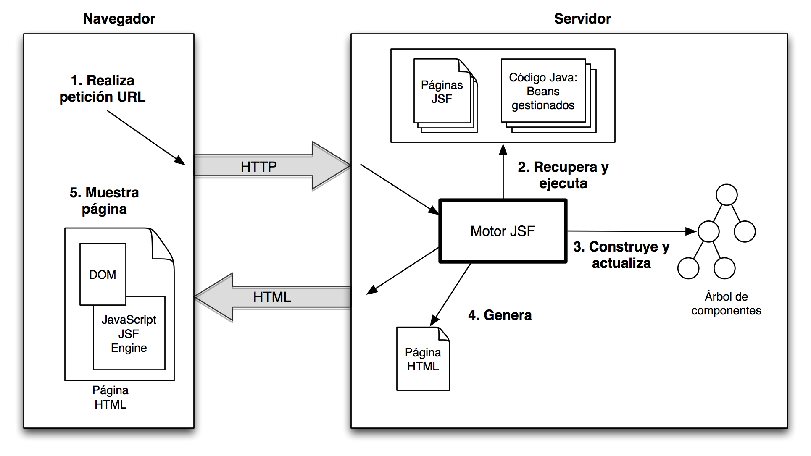

# Un Análisis Detallado de Arquitecturas de Aplicaciones Web: Del Modelo Clásico a la Single-Page Application (SPA)

## 1. Nomenclatura y Semántica de los Diagramas de Arquitectura Web

### Introducción al Concepto de Diagramas de Arquitectura

Los diagramas de arquitectura de software son representaciones visuales que sirven como herramientas fundamentales para documentar, analizar y comunicar el diseño y la estructura de un sistema informático. No se limitan a un único formato, ya que su propósito principal es proporcionar una visión unificada de la funcionalidad del sistema, los componentes que lo integran y el flujo de datos entre ellos, lo que mejora significativamente la colaboración entre los equipos de desarrollo y diseño. Estos diagramas permiten a los interesados identificar riesgos potenciales, como supuestos incorrectos o lógica defectuosa, en las primeras etapas del ciclo de vida del desarrollo, lo que reduce la probabilidad de problemas mayores en fases posteriores.

La disciplina de la arquitectura de software ha desarrollado varios tipos de diagramas formales. Por ejemplo, los diagramas de UML (Unified Modeling Language) como los de componentes y de implementación, se utilizan para modelar la estructura del sistema y cómo el software se despliega en el hardware, respectivamente. Otros diagramas, como los de secuencia o de actividad, se centran en el comportamiento dinámico del sistema y el orden de las interacciones. Esta variedad subraya que la elección de la representación visual depende de la perspectiva que se desee ilustrar, ya sea estructural, de comportamiento o de flujo de datos

### Identificación del Diagrama Proporcionado por el Usuario

La representación visual que ha proporcionado se denomina comúnmente **Diagrama de Arquitectura de Aplicación Web** o, de forma más precisa, **Diagrama de Flujo de Datos y Componentes**. Aunque no se ajusta a una notación formal estricta de UML, como un diagrama de secuencia o un diagrama de comunicación, su valor es didáctico y conceptual. Su objetivo es ilustrar de forma clara y concisa la interacción entre las principales capas de un sistema web, a saber, el navegador del cliente y los sistemas del lado del servidor, a través de la capa de transporte HTTP.

La ausencia de una única nomenclatura estandarizada para este tipo de diagrama conceptual resalta la naturaleza pragmática y evolutiva de la ingeniería de software. A menudo, las representaciones visuales se crean de forma ad-hoc para comunicar un concepto específico de la manera más comprensible posible, en lugar de adherirse rígidamente a un estándar formal. En este caso, el diagrama es una representación efectiva del flujo de funcionamiento de dos modelos de arquitectura distintos, lo que lo convierte en un "diagrama de funcionamiento" que ilustra la relación de las estructuras con los flujos de navegación.

## 2. La Arquitectura del Pasado y del Presente Inmediato

### 2.1 El Modelo Clásico de Aplicación Web (Server-Side Rendering - SSR)

En la parte izquierda del diagrama proporcionado, se ilustra el **Modelo Clásico de Aplicación Web**, que se basa en la arquitectura de renderizado en el servidor (Server-Side Rendering o SSR). Este modelo fue la forma predominante de construir sitios web durante años y aún se utiliza ampliamente, especialmente en sitios donde el contenido estático es primordial.

El flujo de datos en este modelo es secuencial y síncrono.
- **Petición Inicial:** El `browser client` (navegador web) envía una `HTTP request` a un `web server` (servidor web) para solicitar una página específica.
- **Procesamiento en el Servidor:** El servidor recibe la petición y la procesa. Este procesamiento puede implicar la consulta de bases de datos (`datastores`), la ejecución de lógica de negocio (`backend processing`) y la integración con otros sistemas (`legacy systems`) para recopilar toda la información necesaria para construir la página.
- **Generación de la Página:** El servidor genera una página HTML, CSS y JavaScript completa y lista para ser mostrada, y la envía de vuelta al navegador a través del transporte HTTP(s).
- **Renderizado en el Cliente:** El navegador recibe el contenido completo y lo interpreta para mostrar la `user interface` al usuario.

Una característica distintiva de este modelo es que cada interacción significativa del usuario, como hacer clic en un enlace de navegación, inicia un nuevo ciclo de petición-respuesta que resulta en una recarga completa de la página. Esta recarga a menudo se percibe como un "parpadeo" en la interfaz. Sin embargo, este modelo ofrece ventajas claras. El contenido está completamente renderizado en el servidor, lo que lo hace intrínsecamente amigable para el SEO, ya que los rastreadores de los motores de búsqueda pueden indexar el contenido directamente del HTML. Además, la carga inicial de la página suele ser muy rápida, ya que el navegador no tiene que ejecutar grandes cantidades de JavaScript para renderizar el contenido.

### 2.2 El Modelo de Aplicación Web AJAX (Rich Internet Application - RIA)

El lado derecho del diagrama representa una evolución del modelo clásico, conocido como el **Modelo de Aplicación Web AJAX**, que forma parte del concepto de las Rich Internet Applications (RIA). Este modelo surgió como una solución para la falta de interactividad y la experiencia de usuario interrumpida del modelo clásico.

La innovación clave es la introducción de un `Ajax engine` (motor Ajax) en el `browser client`, que es esencialmente código JavaScript.
- **Carga Inicial:** Al igual que en el modelo clásico, la página inicial se carga desde el servidor. Sin embargo, esta página contiene un código JavaScript que permite la comunicación asíncrona.
- **Interacción Dinámica:** El usuario interactúa con la página sin necesidad de una recarga completa. Por ejemplo, al filtrar una lista o enviar un formulario, el `JavaScript call` del `Ajax engine` envía una petición al servidor en segundo plano.
- **Respuesta de Datos:** El servidor, que puede ser un `web and/or XML server`, recibe la petición y, en lugar de generar una página HTML completa, solo devuelve los datos necesarios para la actualización, a menudo en formato XML o JSON.
- **Actualización Parcial:** El `Ajax engine` en el cliente recibe estos datos y los utiliza para actualizar solo la parte relevante de la `user interface`, sin necesidad de recargar toda la página.

Este modelo mejoró drásticamente la experiencia de usuario al permitir interacciones más fluidas y rápidas. Al transferir solo datos y no páginas completas, se reduce el consumo de ancho de banda y se mejora la percepción de rendimiento. No obstante, incrementó la complejidad en el lado del cliente, ya que el JavaScript debía gestionar tanto las peticiones asíncronas como la manipulación dinámica del DOM (Document Object Model)

## 3. La Arquitectura de la Single-Page Application (SPA)

### 3.1 Principios Fundamentales de la Arquitectura SPA

El siguiente paso en la evolución de las arquitecturas web es la **Single-Page Application (SPA)**, o Aplicación de Página Única. Una SPA es una aplicación web o sitio web que encaja en una sola página web, con el objetivo de proporcionar una experiencia de usuario fluida, similar a la de una aplicación de escritorio o móvil nativa. Este modelo es una evolución directa y conceptual del modelo RIA/Ajax, donde el rol del JavaScript en el cliente se expande de una simple herramienta para actualizaciones parciales a ser el gestor completo de la aplicación.

El principio central de una SPA es que todo el HTML, CSS y JavaScript necesarios para la aplicación se cargan inicialmente, de modo que no hay necesidad de recargar la página para que el contenido se actualice o el usuario navegue a una "nueva página". 

En este paradigma, la aplicación`se renderiza` y `corre en el navegador`, mientras que el servidor se convierte en un simple proveedor de datos, generalmente a través de una API (Application Programming Interface).

Este cambio en la división de responsabilidades representa un cambio de paradigma fundamental. Mientras que en los modelos anteriores el servidor dictaba la estructura de la página y el cliente hacía pequeños ajustes, en la SPA, el cliente toma el control total de la experiencia, incluyendo el enrutamiento interno de la aplicación. Esto ha llevado a la proliferación de sofisticados frameworks de JavaScript (como React, Angular y Vue.js) que facilitan la gestión del estado, la navegación y la interfaz de usuario en el lado del cliente.

### 3.2 El Flujo de Datos y Componentes de la SPA (Creación del Diagrama Conceptual)

Debido a que las fuentes de investigación consultadas no contienen un diagrama idéntico que ilustre el flujo de datos de una SPA de la misma forma que el diagrama proporcionado por el usuario , a continuación se presenta una descripción detallada que sirve como plantilla conceptual para dicha representación. La siguiente descripción explica los componentes y el flujo de datos que se representarían en un diagrama similar.
- **Paso 1: La Carga Inicial (`First Load`)*:
	- El proceso comienza con el `browser client` enviando una única `HTTP request` al `web server`.
	- En lugar de una página HTML completa, el servidor responde con un único archivo `index.html` que es, a menudo, mínimo y vacío de contenido, junto con el "bundle" (paquete) completo de `JavaScript` y `CSS` que conforma la aplicación.
- - **Paso 2: El Control del Cliente (`Client-Side Routing and Rendering`)**
    - Una vez que el navegador recibe el paquete de la aplicación, el `JavaScript` se ejecuta.
    - El "motor de SPA" (es decir, el código del framework de JavaScript) toma el control de la `user interface` y el enrutamiento. Esto significa que cuando el usuario interactúa, las URL en la barra de direcciones pueden cambiar, pero esto se gestiona internamente en el navegador sin una recarga de página.
- **Paso 3: Interacción del Usuario (`User Interaction`)**
    - Cuando el usuario hace clic en un elemento interactivo, como un enlace o un botón, el motor de SPA intercepta la acción. En lugar de permitir que el navegador envíe una nueva petición HTTP para una página, el framework determina qué datos necesita para actualizar la interfaz.
- **Paso 4: Petición de Datos Asíncrona (`Ajax/API Request`)**
    - El motor de SPA en el `browser client` realiza una `Ajax/API request` asíncrona.
    - Esta petición no solicita una nueva página, sino que se dirige a un `API server` (un tipo de `web server`) para obtener datos específicos, por ejemplo, los detalles de un producto o el contenido de un post de blog.
- **Paso 5: Respuesta del Servidor (`Server Response`)**
    - El servidor, que actúa como una `API` o `microservicio`, recibe la petición de datos.
    - Procesa la lógica de negocio, consulta sus `datastores` y responde con datos puros, normalmente en formato `JSON/XML data`. No se envía ningún HTML.
- **Paso 6: Actualización del DOM (`DOM Update`)**
    - Finalmente, el motor de SPA en el `browser client` recibe los datos del servidor.
    - Utiliza estos datos para manipular dinámicamente el DOM de la página, reescribiendo y actualizando solo los componentes o secciones relevantes de la `user interface`, sin una recarga de página completa.

### 3.3 Ventajas y Desafíos de la Arquitectura SPA

La arquitectura SPA ha ganado popularidad gracias a sus notables ventajas. Proporciona una experiencia de usuario sumamente fluida e ininterrumpida, imitando la sensación de una aplicación nativa de escritorio, lo cual es ideal para herramientas interactivas. Reduce la repetición de código y de datos transferidos a través de la red una vez que la carga inicial ha finalizado, lo que se traduce en un menor uso de ancho de banda y un rendimiento mejorado en las interacciones subsiguientes. Además, las SPA son una base sólida para la construcción de Progressive Web Apps (PWAs), lo que permite que las aplicaciones web funcionen casi como aplicaciones nativas en dispositivos móviles y de escritorio.

Sin embargo, las SPA no están exentas de desafíos. Uno de los mayores inconvenientes es que el renderizado inicial puede ser lento, ya que el navegador debe descargar un gran paquete de JavaScript y ejecutarlo antes de que la página se vuelva interactiva. Esto también crea un problema fundamental con el SEO y la flexibilidad de los hipervínculos. Los rastreadores de los motores de búsqueda tradicionales, aunque han mejorado, prefieren el contenido que está disponible en el HTML de forma inmediata. Dado que el contenido en una SPA se genera dinámicamente después de que el JavaScript se ha ejecutado, puede ser difícil para los rastreadores indexar correctamente todo el contenido, lo que limita la visibilidad en los resultados de búsqueda.

## 4. Análisis Comparativo: SSR vs. RIA vs. SPA

A continuación, se presenta un análisis comparativo que resume las diferencias clave entre las tres arquitecturas, destacando cómo sus principios de diseño impactan en métricas críticas como el rendimiento, la experiencia de usuario y el SEO.

| Criterio               | Modelo Clásico (SSR)                                                                                                           | Modelo RIA (Ajax)                                                                                                                                      | Single-Page Application (SPA)                                                                                                                       |
| ---------------------- | ------------------------------------------------------------------------------------------------------------------------------ | ------------------------------------------------------------------------------------------------------------------------------------------------------ | --------------------------------------------------------------------------------------------------------------------------------------------------- |
| Carga Inicial          | La página HTML completa se genera en el servidor y se envía al cliente.                                                        | La página inicial completa se envía junto con el "motor" Ajax.                                                                                         | Se envía un único archivo HTML minimalista, junto con todo el paquete de la aplicación (JavaScript y CSS).                                          |
| Flujo de Datos         | Cada interacción del usuario (navegación) resulta en una nueva petición y una recarga completa de la página desde el servidor. | Las interacciones específicas envían peticiones asíncronas para obtener datos, que se usan para actualizar parcialmente el DOM.                        | Las interacciones con la aplicación son gestionadas por el JavaScript del cliente, que hace peticiones de datos a una API.                          |
| Experiencia de Usuario | Lenta e interrumpida. Se percibe un "parpadeo" de la pantalla con cada navegación.                                             | Mejorada y más fluida que en el modelo clásico, pero la navegación entre "páginas" puede seguir requiriendo recargas.                                  | Súper fluida, sin interrupciones ni recargas. Similar a una aplicación de escritorio o nativa.                                                      |
| SEO                    | Amigable con los motores de búsqueda por defecto, ya que el contenido se entrega completamente renderizado.                    | Puede ser un desafío, ya que parte del contenido se carga de forma asíncrona, pero es manejable.                                                       | Presenta desafíos inherentes, ya que los rastreadores deben ejecutar JavaScript para ver el contenido dinámico.                                     |
| Complejidad            | Mayor complejidad en el lado del servidor para generar las páginas. El cliente es "tonto".                                     | La complejidad se distribuye. El servidor aún genera páginas, pero el cliente se vuelve más complejo para gestionar las actualizaciones.               | La mayor parte de la lógica de la aplicación y la complejidad de enrutamiento se desplaza al lado del cliente. El servidor se simplifica a una API. |
| Caso de Uso Ideal      | Sitios con mucho contenido estático como blogs, noticias, o sitios de e-commerce que priorizan el SEO.                         | Aplicaciones que requieren funcionalidades asíncronas dentro de un flujo de varias páginas, como formularios complejos o búsquedas con autocompletado. | Aplicaciones altamente interactivas como dashboards, plataformas de streaming de video, redes sociales o herramientas de productividad.             |
## 5. Consideraciones de Diseño y Recomendaciones

### Cuándo Elegir Cada Arquitectura

La elección de la arquitectura adecuada es una decisión estratégica que debe basarse en el propósito de la aplicación y las prioridades del proyecto.

- El **modelo Clásico (SSR)** es la opción más sensata cuando el SEO es una prioridad absoluta y el contenido es la razón de ser de la aplicación. Es ideal para blogs, sitios de noticias, portales de información o cualquier proyecto donde la visibilidad en los motores de búsqueda sea más importante que una experiencia de usuario altamente interactiva.
- El **modelo RIA (Ajax)** se sitúa en un punto intermedio y puede ser adecuado para aplicaciones que no son completamente dinámicas, pero que se benefician de interacciones asíncronas puntuales dentro de un flujo de navegación tradicional.
- La **Single-Page Application (SPA)** es la elección preferida cuando la experiencia de usuario, la velocidad de interacción y la fluidez de la interfaz son los objetivos principales del proyecto. Es ideal para aplicaciones donde el usuario pasará un tiempo considerable interactuando con la interfaz, como herramientas de análisis de datos, plataformas de colaboración o aplicaciones internas de empresa.
### Desafíos y Soluciones (Arquitecturas Híbridas)

La tensión entre el renderizado inicial y el rendimiento posterior ha llevado a la evolución de arquitecturas híbridas. Las soluciones modernas buscan combinar lo mejor de ambos mundos: el rápido tiempo de carga y el SEO amigable del renderizado en el servidor, con la experiencia de usuario fluida y la interactividad de las aplicaciones de una sola página.

# Apartado de diagramas de diferentes situaciones. 

Aqui encontramos lo que es el funcionamiento de JSF. 

