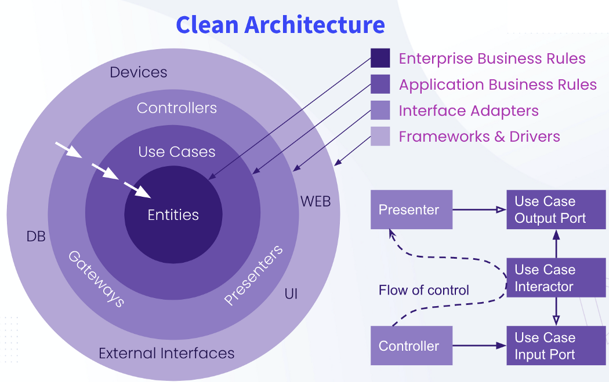

---
A lo largo de este escrito voy a recopilar información de diferentes lados incluyendo del mismo libro del cual hace referencia

---
# YouTube Gentleman programming
Todo empieza entendiendo que las arquitecturas se dan para poder crear programas escalables a nivel de código. Para la Clean Architecture tenemos diferentes capas. 
	- Dominio
	- Caso de usos
	- Adaptadores
	- Capa Externa
El dominio representa la lógica de negocios y le sumamos lo que son las entidades.

- **Lógica de negocio**: Todos los requerimientos, el cual no depende de la tecnología. Por ejemplo: el rango de edad es que debe ser mayor de 18 años. Un requerimiento NO limitado en una tecnología
- **Entidades**: Las entidades son aquellas que representan ese algo del dominio, en casos podría ser: Usuario, Banco, ... Cualquier cosa que tenga que ver en una referencia a la lógica del negocio
Los Casos de Uso o Use Cases, son los requerimientos que vienen por la lógica de la aplicación
- **Lógica de aplicación**: Requerimientos por el cual tenemos una limitación de la tecnología

Nada debe romper el dominio, toda la arquitectura se basa en darle soporte a la lógica de negocio

La lógica de aplicación no solo da los casos de uso, sino que también acerca las entidades a la lógica del negocio

Antes de ir a por los adaptadores, debemos entender la capa externa, estos son *RECURSOS,* el cual nosotros usamos dentro de nuestra aplicación que el día de mañana puede cambiar (Como una API call), también los recursos deben ser intercambiables sin ningún tipo de problema. 

El adapter o adaptador es quien se comunica con la parte de afuera como la de adentro, es una capa que tiene doble flecha | middleware. 

---
No todas las arquitecturas son las mismas, cada una cumple ciertas condiciones, cada una se adecua mejor a los problemas. Debemos saber las ventajas y desventajas de cada una y de su propósito. 

Nosotros tenemos: 
	- Requisitos Técnicos
	- Requisitos funcionales y no funcionales
	- Limitaciones
- **Requisito técnico:** Qué cumplir para que el sistema funcione correctamente, debe satisfacer los requisitos funcionales.
- **Requisitos funcionales:** Son aquellos que definen a nuestro sistema 
- **Limitaciones:** Son aquellas que van a ser una contra a la hora de satisfacer los requisitos en general. (una limitación es la gente que trabaja en el sistema, por ejemplo, falta de conocimiento.)

Todas las arquitecturas intentan separar las responsabilidades para que sea fácil mantener, extender y comprender. Así separamos los casos de uso de lógica de negocio de los que son funcionales, que diferencias hay.

La **Clean Architecure** organiza por capas la lógica de nuestra aplicación.

---

# Medium 
## Medium 1

Una forma de ver esto en organización de carpetas: [medium](https://medium.com/@developerstory/how-should-the-folder-structure-look-when-implementing-clean-architecture-for-a-project-d2dc88de6c47)
Tomando en cuenta, tenemos: 
- **Core (Domain):** La lógica del negocio de la aplicación, incluyendo las entidades, eventos, enums e interfaces, excepciones 
	- Tenemos ejemplos como: `VulnerabilityDetectedEvent`, interfaces como: `IRepository, IDomainEventHandler, IUnitOfWork` y excepciones como: `SlackConfigurationNotFoundForOrganization.cs`.
- **Application** Este contiene comandos, consultas, handlers (En caso de usar CQRS y Mediator), los casos de uso (servicios), y cuyos servicios que implementan la lógica del negocio.
- **Infraestructura:** Este contiene la implementación de los servicios externos como repositorios e integración de API (Slack API, Kafka, RabbitMQ, SQS), contexto de migración, servicios 3rd party. Email e identidad de proveedores también van aqui.
- **Presentación (API):** Este contiene aquello que expone endpoints al mundo. Como controladores, DTO, ViewModels, Middleware (errorhandling, logging), Configuraciones, etc.
- **SharedKernel (opcional)**: Son extensiones, funcionalidades comunes como `DatetimeExtensions.cs, Guard.cs, BaseEntity.cs, URLHelper.cs, SerilogExtensions.cs etc`.
- **Test:** Este contiene todo lo relacionado a QA.

El conglomerado de carpeta queda: 
```text
/src  
    /Domain  
        /Entities - Vulnerability.cs - Organization.cs - SlackIntegration.cs   
        /Interfaces IVulnerabilityRepository.cs - IOrganizationRepository.cs - INotificationService.cs - ISlackIntegrationRepository.cs  
        /Events - SlackIntegrationAddedEvent.cs -VulnerabilityDetectedEvent.cs  
        /Exceptions - SlackIntegrationException.cs - VulnerabilityNotificationException.cs  
    /Application (also called service layer)  
        /UseCases - AddSlackIntegrationUseCase.cs - RemoveSlackIntegrationUseCase.cs - NotifySlackOnVulnerabilityUseCase.cs  
        /Services (UseCases can also be services depending on implementation)  
        /Commands (In case you use CQRS with Mediatr) - AddSlackIntegrationCommand.cs - RemoveSlackIntegrationCommand.cs  
        /Handlers - AddSlackIntegrationCommandHandler.cs  
        /Queries - GetSlackIntegrationsQuery.cs  
        /Validators - AddSlackIntegrationCommandValidator.cs  
        /DTOs - AddSlackIntegrationRequest.cs - RemoveSlackIntegrationRequest.cs - SlackNotificationDTO.cs  
        /Interfaces - IAddSlackIntegrationService.cs - IRemoveSlackIntegrationService.cs - IVulnerabilityNotificationService.cs  
    /Infrastructure  
        /Persistence - ApiDbContextSeed.cs - ApiDbContext.cs  
        /Behavior - ValidationBehavior.cs  
        /Migrations  
        /Repository -SlackIntegrationRepository.cs - VulnerabilityRepository.cs - OrganizationRepository.cs  
        /MessageBrokers - KafkaConsumerService.cs - KafkaProducerService.cs  
        /Slack - SlackApiClient.cs - SlackNotificationService.cs  
    /API (Presentation)  
        /Controllers - SlackIntegrationController.cs - NotificationController.cs  
        /ViewModels - AddSlackIntegrationViewModel.cs - RemoveSlackIntegrationViewModel.cs  
        /Middleware - ExceptionHandlingMiddleware.cs - GlobalExceptionHandler.cs  
    /Shared  
        /Extensions  
        /Helpers - SlackIntegrationHelper.cs  
/tests  
    /Core.Tests - SlackIntegrationTests.cs - VulnerabilityTests.cs   
    /Application.Tests - AddSlackIntegrationUseCaseTests.cs - NotifySlackOnVulnerabilityUseCaseTests.cs          
    /Infrastructure.Tests - SlackIntegrationRepositoryTests.cs - KafkaConsumerServiceTests.cs   
    /Presentation.Tests - SlackIntegrationControllerTests.cs - NotificationControllerTests.cs  
/piplines  
/terraform  
Directory.Build.props  
Directory.Packages.props  
global.json  
.gitignore
```

Usa un ejemplo en C# que se ve en [GitHub](https://github.com/EceE91/CleanArchitecture)

# Paginas web: 

[Web](https://www.milanjovanovic.tech/blog/clean-architecture-folder-structure)
Aquí nos muestra otra forma en la que se ve la arquitectura limpia o Clean Architecture. Y este cuadra más con lo planteado en el apartado de Medium. Aquí nos comenta: 
## Capa de Dominio:
Aquí se agregarán cosas como: entidades, objetos de valor, agregados, eventos del dominio, repositorio de interfaces, etc. Como por ejemplo: 
```
📁 Domain
|__ 📁 DomainEvents
|__ 📁 Entities
|__ 📁 Exceptions
|__ 📁 Repositories
|__ 📁 Shared
|__ 📁 ValueObjects
```
Y podemos meter más cosas de ser necesarias. Aquí no referenciamos otros proyectos o algo diferente que no sea la solución. 
## Capa de aplicación:
La capa de aplicación se sitúa por encima de la capa de dominio. Esta actúa como un orquestador para la capa de dominio, teniendo los casos de uso más importantes en la aplicación.

Podemos estructurar usando casos de uso o usando comandos y queries. Quien nos habla es alguien que le encanta el patrón **CQRS**, así que usa el patrón comando y una aproximación con queries.
Aquí su implementación con folders: 
```
📁 Application
|__ 📁 Abstractions
    |__ 📁 Data
    |__ 📁 Email
    |__ 📁 Messaging
|__ 📁 Behaviors
|__ 📁 Contracts
|__ 📁 Entity1
    |__ 📁 Commands
    |__ 📁 Events
    |__ 📁 Queries
|__ 📁 Entity2
    |__ 📁 Commands
    |__ 📁 Events
    |__ 📁 Queries
```
## Capa de Infraestructura: 
Este contiene la implementación para servicios externos
Que podemos encontrar? 
- Bases de datos
- Proveedores de identidad (Auth0, Keycloak)
- Proveedores de email
- Servicios de almacenamiento (AWS S3, Azure Blob Storage)
- Cola de mensajes (RabbitMQ)
¿Cómo es la organización?: 
```
📁 Infrastructure
|__ 📁 BackgroundJobs
|__ 📁 Services
    |__ 📁 Email
    |__ 📁 Messaging
|__ 📁 Persistence
    |__ 📁 EntityConfigurations
    |__ 📁 Migrations
    |__ 📁 Repositories
    |__ #️⃣ ApplicationDbContext.cs
|__ 📁 ...
```
No es fuera de lo común hacer el folder de persistencia aqui. Frecuentemente, quien escribió el post lo hace para tener todo el contexto en un apartado.
## Capa de presentación:
La capa de presentación es el punto de acceso a nuestro sistema. Típicamente, es el medio por el cual puedes implementar el sistema como una Web API. 
La parte más importante de la presentación son los controladores, son quienes definen los endpoints de la API de nuestro sistema.

La estructura es: 
```
📁 Presentation
|__ 📁 Controllers
|__ 📁 Middlewares
|__ 📁 ViewModels
|__ 📁 ...
|__ #️⃣ Program.cs
```
Aquí en esta capa (según ChatGPT que le pregunté) es donde van los DTO para I/O de la aplicación, aquí se colocan también, si se desea o en un paquete "shared" los mapper, estos pueden ser estáticos (en su defecto lo son).

---
Otra pagina web es: 
https://www.mentorestech.com/resource-blog-content/arquitectura-limpia-clean-architecture

Importante! , ahí habla chevere de eso en typescript.


---
Otra forma que yo adapte: 
```
📁 src
├── 📁 configuration
├── 📁 domain
│   ├── 📁 models
│   ├── 📁 casouso (staticas | logica de negocio)
│   └── 📁 valueobjects (enums o cosas asi)
│
├── 📁 application
│   ├── 📁 services (logica de aplicacion e interfaces)
│   ├── 📁 cqrs
│   │   ├── 📁 command
│   │   └── 📁 query
│   ├── 📁 dto
│   ├── 📁 mapper (mapea de dominio a aplicacion y aplicacion dominio)
│   └── 📁 repositories
│
└── 📁 infrastructure
    ├── 📁 adapters (logica de aplicacion implementada )
	├── 📁 mapper (mapea de aplicacion a (request/response) y aplicacion a entidad )
    ├── 📁 controllers
    │   └── 📁 dto
    ├── 📁 filters
    ├── 📁 websockets
    ├── 📁 entities
    └── 📁 repositories
	    └── 📁 adapter (implementa repository de aplicacion)
	    └── 📁 jpa (lo que usa el adapter para buscar, jpa)
    

```