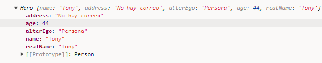

# Angular

[https://devtalles.com/files/angular-cheat-sheet-v2.pdf](https://devtalles.com/files/angular-cheat-sheet-v2.pdf)

Primero vamos a mirar dos maneras de ejecutar un código, primero en javascript y luego en typescript. 

Tenemos en javascript: 

```jsx
function calcularISV(producto){
	let total = 0;
	
	producto.forEach( ({precio}) => {
			total +=precio;
	});
	
	return [total,total*0.15];
}
```

Es claro lo que esta función realiza, sin embargo en Typescript quedaría: 

```tsx
function clacularISV(producto: Producto[] ) : [number,number]{
		
	let total = 0;
	
	producto.forEach( ({precio}) => {
			total +=precio;
	});
	
	return [total,total*0.15];

} 

/// Esto se sale debido a la interfaz _ 
interface Producto {
	desc: string;
	precio: number;
}
```

Esto es la manera en que indicamos que devuelve como tal.

---

# Primera Parte [Typescript] :

### **¿Qué veremos en esta sección?**

Este es un breve listado de los temas fundamentales:

### Introducción a TypeScript

### Tipos básicos

Dentro de los tipos básicos tenemos una nomenclatura para poder, de esta forma darle sentido a un dato. Es decir darles el tipo y es mediante: 

```tsx
let numero: number = 15;
let skills: string[] = ["strign1","string2","string3"];
const noCambia: string = "Valor que no cambiará xd";
```

Para esto tenemos el dos puntos y al frente el tipo de dato que nosotros deseamos.

Si la variable no cambia entonces se usa el seudónimo de `const` .

### Objetos, arreglos e interfaces

Los objetos e interfaces son creados para mejorar la legibilidad del código.

```tsx
//Para las inerfaces tenemos: 
interface Character {
	nombre: string;
	vida: number;
	skills: string[];
	pueblo?: string;
}
```

Esto quiere decir que si llegamos a crear un objetos [QUE RECORDAR QUE LOS OBJETOS SON DE TIPO JSON] va a tener que seguir estas propiedades, por ejemplo: 

```tsx
// Entonces
const player1:Charactyer = {
	nombre: "luis",
	vida: 17,
	skills: ["Rango alto","Contra envenenamiento"],
}
//Al ser pueblo opcional, podemos o no agregarlo
```

### Funciones y sus argumentos

las funciones son igual de intuitivas y similares como en cualquier lenguaje, existen las funciones flecha, las funciones donde para recibir un objeto se necesita la interfaz y asi determinar que tipo de objeto se requiere, etc. 
Para un ejemplo de todas tenemos: 

```tsx
function addNumbers(a: number, b: number): number {
    return a + b;
}

const functionArrow = (a: number, b: number): string => {
    return `${a + b}`;
};

const sumaFuncion1: number = addNumbers(1, 2);
const sumaFuncion2: string = functionArrow(1, 2);
console.log({ sumaFuncion1, sumaFuncion2 })

//Crear funciones que no son obligatoria [parametros] o definidos automaticamente, es decir: 
function multiply(numero1: number, numero2?: number, base: number = 5): number {
    return numero1 * base;
}

const multiplyResult = multiply(5);
console.log({ multiplyResult })

// Para poder poner Objetos como parametro en las funciones debemos de establecer una interfaz

interface Objeto1 {
    name: string;
    edad: number;
    showEdad: () => string; // Así se declaran los metodos de las interfaces 
}

function funcionObj(obj: Objeto1, edad: number) {
    obj.edad += edad;
}
// creamos el objeto: 
const player: Objeto1 = {
    name: "Luis",
    edad: 11,
    showEdad: function (): string {
        return String(this.edad);
    }
}

funcionObj(player, 1);

console.log(player)
```

### Desestructuración de arreglos y objetos

La destructuración de objetos es algo bastante sencillo , la idea es, si son objetos tomar la forma de los objetos como “nombre” y si son arreglos la estructura de los arreglos como “nombre”, ejemplo: 

```tsx
interface AudioPlayer {
    audioVolume: number;
    songDuration: number;
    song: string;
    details: Details;
}

interface Details {
    author: string;
    year: number;
}

const audioPlayer: AudioPlayer = {
    audioVolume: 90,
    songDuration: 36,
    song: "Mess",
    details: {
        author: "Ed Sheeran",
        year: 2015
    }
}

const { song } = audioPlayer; // esta es la manera en que destructuramos, por lo general tiene este aspecto: 
// const { propiedad:nombreVariable } = objeto o Arreglo : 

const { details: detalles, song: cancionxd, songDuration: duracion } = audioPlayer;
const { author: autor } = detalles;

console.log("Detalles: ", detalles, "\nNombre: ", cancionxd, "\nDuracion: ", duracion, "\nAutor: ", autor);

// Ahora la desestructuracion de los Arreglos: 

const [, , num1 = "numero no econtrado"]: string[] = ["1", "58", "6215", "1", "5"];

console.log("Numero: ", num1)

```

Tambien podemos pasarlos como funciones, haciendo: 

```tsx
interface Product {
    descripcion: string,
    price: number;
}

const phone: Product = {
    descripcion: "Nokia A1",
    price: 150.0,
}

const table: Product = {
    descripcion: "iPad Air",
    price: 250.0
}

interface TaxCalculationOptions {
    tax: number;
    products: Product[];
}

function taxCalculation(options: TaxCalculationOptions): [number, number] {
    let total = 0;
    const { products: productos, tax } = options;

    productos.forEach(({ price: precio }) => {
        total += precio;
    })

    return [total, total * tax];
}
const shopingCard = [phone, table];
const tax = 0.15;
const [total, taxProducts] = taxCalculation({
    products: shopingCard,
    tax,
});

console.log("Total: ", total)
console.log('Tax: ', taxProducts)

```

### Importaciones y exportaciones

Las importaciones y exportaciones se manejan de forma similar a la destructuración de datos, usamos el `import` y `export` en las clases que necesitamos . ejemplo: 

```tsx
/*Para la clase uno tenemos una funcion, para poderla exportar, hay varios
* metodos por ejemplo esta el de colocar un export a la izquierda de lo que
* deseamos exportar EJ: 
*/
export interface Lapiz{
	color: string,
	tamaño: number,
	tipo: string,
}

export function contarLapices(lapices: Lapiz[]):number {
	return lapices.lenght(); 
}
```

Para realizar la importación : 

```tsx
import {contarLapices: contar , Lapiz } from './direccion'

/*
*  Creacion de algunos lapices aleatoreamente con "caja" como nombre . . .
* de tipo Lapiz[]
*/

const cantLapiz:number = contar(caja);

console.log("Cantidad de lapices en la caja son: ",cantLapiz);  
```

### Clases, constructores

Las clases y constructores son básicamente lo mismo que hemos hecho en otros lenguajes de programación, tiene algunas diferencias semánticas o de entendimiento por la depuración pero sigue siendo prácticamente lo mismo: 

```tsx
export class Person {
    private name?: string;
    private address?: string;
    constructor(nombre?: string, address?: string) {
        this.name = nombre;
        this.address = address || "No hay correo";
    }
}
// DOS MANERAS DE HACER EXACTAMENTE LO MISMO
export class Person2 {
    constructor(
        private name: string,
        private address: string  = "No hay corro"
    ) { }
}

const ironman = new Person("Persona");

console.log(ironman)
```

Como vemos son dos maneras de escribir exactamente lo mismo, uno declarándolo fuera del constructor y otro declarándolo dentro. Esta diferencia es sutil pero hace todo mas corto y no deja de ser legible.

→ La extensión o la herencia se usa mediante la palabra `extends` al igual que se hace en JAVA, el código quedaría de la siguiente manera: 

```tsx
// Ahora vamos a extender: 
export class Hero extends Person {
    constructor(
        private alterEgo: string,
        private age: number,
        private realName: string,
    ) {
        super(realName);
    }
}
const ironman = new Hero("Persona", 44, "Tony");

console.log(ironman)
```

Generando una compilación del siguiente tipo: 



Dentro de lo que nosotros conocemos siempre hay algo que debemos de saber y es: 

<aside>
💡 SIEMPRE HAY QUE PRIORIZAR LA COMPOSICION A LA HERENCIA → INYECCION D.

</aside>

Una inyección de dependencia puede visualizarse de la siguiente manera: 

```tsx
// en vez de extender directamente de Person, podemos: 
export class Hero {
		constructor(
		private alterEgo: string,
		private age:number,
		private realName: string,
		private person:Person,
		){}
}

// Aqui ahora podemos hacer: 
const tony = new Person("Tony Stark", "New York");
const ironman = new Hero("IronMan", 45, "Tony",tony);
```

Esto crea una “inyección de dependencias” de Persona a la clase Hero. 

### Tipos genéricos

Los tipos genéricos son atributos o propiedades propio de funciones o clases, aqui funciona: 
de esta forma

```tsx
//Los genericos, las funciones genericas, tambien existentes en java o c++ , 
// son los tipicos templates, etc.
// usamos <T> para definirlo : 

export function whatsMyType<T>(argument: T): T {
    return argument;
}
let soyString = whatsMyType<string>("Hola"); // -> Es una manera
let soyString2 = whatsMyType("Hola2"); // es la otra manera
let soyNumero = whatsMyType(153);

//La primera forma es para determinar por defecto que esperar en el argumento
//la segunda forma es para hacerlo de manera mas inmediata sin la validacion del
// argumento
```

### Decoradores

Los decoradores simplemente es lo mismo que conocemos en java

### Encadenamiento opcional

El encadenamiento opcional es el uso de ! y ? en los valores o tipos, ejemplo: 

```tsx
interface Passanger{
		name:string;
		childen?:string[];
}

const printChilden = (passanger: Passanger )=> {
		const howManyChildren = passenger.childen?.lenght;
		// Esto genera un tipo de number o undefind
		// para generar que sea solo de tipo numero: 
		const howManyC = passanger.children?.lenght || 0; //-> Genera solo number
		
		console.log(passanger.name,howmanyChildren);
		
		return howManyChilden;
}

// Para que haya una obligatriedad dentro de los childen, porque deben de tener
// usamos: 

const printChildenOb = (passanger:Passanger):number => {

		const howManyChildren = passanger.childen!.lenght;
		
		return howManuChildren;
}

```

# Segunda Parte [Angular] :

El listado de lo que se vera será: 

## Crear proyectos en angular:

Para crear un proyecto en angular se debe usar un comando sencillo donde se encuentra nuestra carpeta, mediante el cmd ,o alguna terminal. 

`ng new 'nombre-app' --standalone false`

## Componentes

Dentro de los componentes de angular son bloques  de construcción reutilizables y autónomos que encapsulan la lógica, la pantalla, y los estilos de una parte especifica de la pantalla.

Estos se crean mediante los decoradores, en este caso `@component`  más algunas lineas de código por defecto: 

```tsx
import { Component } from '@angular/core';

@Component({
  selector: 'app-heroes-list',
  templateUrl: './list.component.html',
  styleUrl: './list.component.css'
})
export class ListComponent {

  public heroNames: string[];
  public deleteHero?: string;
  constructor() {
    this.heroNames = ["Spiderman", 'Ironman', 'Hulk', 'She Hulk', 'Thor']
  }

  removeLastHero(): void {
    const deleteHero = this.heroNames.pop();
    this.deleteHero = deleteHero;
  }

}
```

En este código podemos observar que importamos directamente de  ‘@angular/core’  el componente “Component” , para de esta manera poder utilizarlo como decorador de la clase ListComponent. Este componente establece varias opciones como lo son 

- selector: Propone la manera en que será llamado en el HTML, en este caso seria `<app-heroes-list></app-heroes-list>`
- templateUrl: Establece mediante un url cual es el HTML asociado a este selector, para que al llamarse aparezca directamente, tambien se puede usar template a secas para introducir código HTML ahí directamente.
- styleUr: Al igual que el templateUrl , y semejante a template a secas, esta propiedad designa una hoja de estilos acompañada.

## Módulos

Los NgModules son **contenedores para un bloque cohesivo de código dedicado a un dominio de aplicación, un flujo de trabajo o un conjunto de capacidades estrechamente relacionadas**. Pueden contener componentes, proveedores de servicios y otros archivos de código cuyo alcance está definido por el NgModule que los contiene.

Por ejemplo: 

```tsx
import { NgModule } from "@angular/core";
import { HeroComponent } from "./hero/hero.component";
import { ListComponent } from "./list/list.component";
import { CommonModule } from "@angular/common";

@NgModule({
  declarations: [
    HeroComponent,
    ListComponent
  ],
  exports: [
    HeroComponent,
    ListComponent
  ],    
  imports: [
    CommonModule
  ]
})
export class HeroesModule {

}

```

Es un modulo de héroes, que tiene dos componentes. 

```tsx
import { NgModule } from "@angular/core";
import { CounterComponent } from "./components/counter/counter.component";

@NgModule({
  declarations: [
    CounterComponent
  ],
  exports: [
    CounterComponent
  ]
})
export class CounterModule { }

```

O este que es un modulo de Counter .

## ngIf y ngIf-else

El ngIf y ngFor (por ahora quitando a ngIf-else) son directivas creadas para poder distribuir lógica typescript dentro del HTML, en este caso los if y los for, asi pudiendo crear etiquetas no permanentes o múltiples etiquetas dependiendo de una propiedad de la clase, por ejemplo: 

```tsx
<ul class="mt-2 list-group">
  <li *ngFor="let name of heroNames" class="list-group-item ">{{name}}</li>
</ul>
```

Esto crea una lista de <li> con clase : list-group-item en donde , como se ve en el componente


los nombres a quien hace referencia son [Spiderman, Ironman, Hulk, She-Hulk, Thor].
Creando: 


Mientras que el *ngIf se usaria: 

```html
<div *ngIf="deleteHero else nothingWasDelete">
  <h3>Héroe Borrado <small class="text-danger">{{deleteHero}}</small></h3>
</div>
<ng-template #nothingWasDelete> <!-- Esto es una referencia local-->
  <h3>No ha borrado nada</h3>
</ng-template>
```

Aqui identificamos que en el if usa directamente a `deleteHero` que en la clase esta como: undefined, al estar undefined lo toma como falso, o vacío; entonces básicamente dice que si no es vacío que ejecute el marcado de texto dentro de la directiva del `div` de lo contrario cree la recencia local “ng-template” en vez de lo que la directiva div enmarca. 

# Tercer Parte [ Expandir Bases]

Para crear los módulos de manera automática usamos el terminal y Angular/CLI .

```bash
ng g m [nombre]
```

## FormsModule

## ngModel

## @Inputs

## @Outputs

## Servicios

## Métodos en servicios