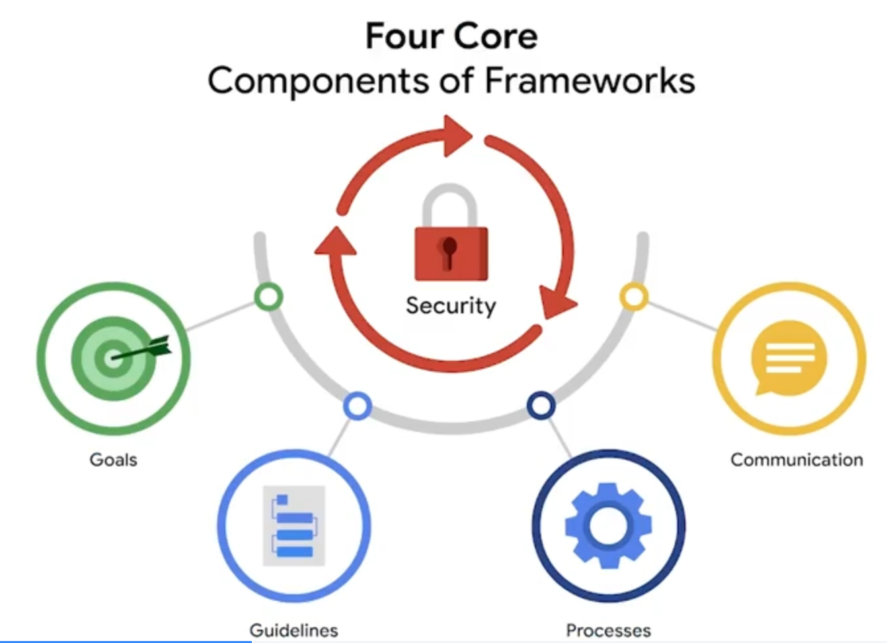

# Ciberseguridad

Curso de Coursera [Google]:

> Actividades a realizar en el curso [Coursera] :
1. Detectar y responder ataques
2. Monitoreo y protección de redes
3. Investigación de incidentes
4. Escribir código para automatizar tareas
> 

> Programa:
1. Conceptos básicos de ciberseguridad
2. Ámbitos de seguridad
3. Seguridad de Redes
4. Computación básica.
5. Activos, amenazas y vulnerabilidades
> 

---

# Tabla de Contenido

---

# Modulo 1

> **Bienvenido al apasionante mundo de la ciberseguridad**
> 

<aside>
💡

Los objetivos a cumplir en este modulo es: 

- Definir seguridad
- Trabajos de responsabilidad
- Habilidades básicas de un analista en ciberseguridad
- Valor de la seguridad
</aside>

## Introducción a la Ciberseguridad.

Cuáles son las responsabilidades de un básicas de un analista de seguridad?: 

- Proteger los computadores y las redes del sistema.
- Instalar softwares preventivos
- Programar auditorias periódicas sobre seguridad

---

<aside>
📎

## Habilidades generales de un analista en ciberseguridad.

- Comunicación
- Colaboración
- Análisis
- Resolver problemas y diversidad de perspectivas
- Gestión del tiempo
</aside>

<aside>
📎

## Habilidades Técnicas de un analista en ciberseguridad

- Lenguajes de programación
- Conocimiento del panorama de amenazas
- Sistemas de detección de intrusiones
- Respuesta a incidente
</aside>

Otro de las cuestiones importantes para entender todo, tambien radica en dos términos: ***Personal Identificable information (PII)***  que tiene relacion con cualquier tipo de información usada para inferir la identidad de individuos, incluye cosas como el nombre, celular, el email; ***Sensitive personally identificable information (SPII)*** son específicos tipos de PII que está sujeto a directrices de tratamiento más estrictas como lo son números de seguridad social o medica, información de finanzas, datos biométricos.  

SIEM = Informacion de seguridad y gestión de eventos permiten a profesionales de la ciberseguridad identificar y analizar amenazas, riesgos y vulnerabilidades.

# Modulo 2

> **La historia de la ciberseguridad**
> 

<aside>
💡

Los objetivos a cumplir en este modulo es: 

- Virus
- Malware
- Ingeniería social
- Era digital
- Dominios de seguridad
</aside>

Hablando de los virus o los malware nosotros encontramos diferentes a lo largo de la historia: 

En 1986 los hermanos Alvi crearon el “Brain viurs” que fue creado para atacar copias ilegales de software medico y evitar licencias piratas, sin embargo el virus atacaba el computador y a cualquier disco que tuviera contacto con el, y este disco malicioso podía pasar el virus de un pc a otro y se fue esparciendo a lo largo de dos meses destruyendo datos y hardware. Otro de los ataques computacionales mas influyentes fue el “Morris worm” en 1988 el cual se propago rápidamente por internet cuya función era modificar, borrar o encriptar archivos de forma maliciosa. Gracias a eso se creo CERT’s : 

CERT Security es un equipo de expertos en seguridad informática que se encarga de responder a incidentes de ciberseguridad

**Objetivos:**

- Prevenir, detectar y responder a incidentes de seguridad
- Limitar el daño en los sistemas informáticos
- Garantizar la continuidad de los servicios
- Proporcionar alertas y pautas para el manejo de incidentes
- Realizar campañas de concienciación pública
- Participar en investigaciones para mejorar los sistemas de seguridad

## Ataques de la era digital

Dentro de la era digital encontramos dos de los más importantes, como lo es el **LoveLetter** y el **Equifax breach.**

En los 2000 Onel De Guzman creo el **LoveLetter Attack** para robar las credenciales de ingreso. Primero se enviaba un correo o email a una persona y al abrirlo se instalaba el malware y automáticamente enviaba un correo con el asunto de “carta de amor” a los contactos. Esto hizo que se propagara muy rápidamente infectando al rededor de 45 millones de computadores. Esté LoveLetter Attack es el primer ejemplo de ingeniería social .

***Ingeniería social:** Es una técnica de manipulación que aprovecha los errores humanos para ganar información privada, acceso o bienes de valor.*

***Phising:** Es el uso de las comunicaciones digitales para engañar gente con el fin de revelar datos sensibles o desplegar un software malicioso* 

Equifax, una de las tres agencias de informes crediticios de consumo más grandes de Estados Unidos, anunció en septiembre de 2017 que sus sistemas habían sido violados y que los datos personales confidenciales de 148 millones de estadounidenses habían sido comprometidos.

### Pishing

**Phishing** es el uso de comunicaciones digitales en las que se suplanta la identidad de una persona o empresa con el objetivo de engañar a otras personas para que revelen datos confidenciales o implementen un software malicioso.

Algunos de los tipos más comunes de ataques de phishing actuales son:

- **Compromiso del correo electrónico empresarial (BEC):** el agente de amenaza envía un mensaje de correo electrónico que parece provenir de una fuente conocida, para efectuar una solicitud aparentemente legítima de información o intentar que realice una acción, con el fin de obtener un beneficio financiero.
- **Phishing localizado (Spear phishing):** un tipo de phishing focalizado en el que se envía un correo electrónico malicioso a un/a usuario/a o a un grupo de usuarios/as específicos/as, que parece provenir de una fuente confiable.
- **Ataque “caza de ballenas” (Whaling):** un tipo de phishing localizado mediante el cual los agentes de amenaza buscan acceder a los datos confidenciales de ejecutivos/as de una empresa.
- **Vishing:** un tipo de estafa por suplantación de identidad en la que se busca obtener información sensible a través de una llamada telefónica.
- **Smishing:** ataque de phishing por SMS que implica el uso de mensajes de texto para engañar a los/las usuarios/as, con el fin de obtener información confidencial o hacerse pasar por una fuente conocida.

### Software malicioso

El **software malicioso** es un software diseñado para dañar dispositivos o redes. El propósito principal de quienes realizan el ataque es obtener dinero o, en algunos casos, información que pueda utilizarse en contra de una persona, una organización o un territorio.

Algunos de los tipos más comunes de ataques de software malicioso actuales son:

- **Virus informático:** un código malicioso creado para interferir con las operaciones de la computadora y dañar datos, software y hardware. El virus se instala en programas o documentos de una computadora y luego, se propaga e infecta una o más computadoras en una red.
- **Gusano:** un software malicioso que puede duplicarse y propagarse por sí mismo en los sistemas.
- **Ransomware (secuestro de datos):** un ataque malicioso en el que los agentes de amenaza cifran los datos de una organización y exigen un pago (rescate) para restablecer el acceso a ellos.
- **Spyware:** un tipo de software malicioso que se usa para recabar y vender información sin consentimiento. El spyware se puede usar para acceder a dispositivos, lo cual permite a los agentes de amenaza recopilar datos personales, como correos electrónicos, mensajes de texto, grabaciones de voz e imagen y ubicaciones de índole privada.

### Ingeniería Social

La **ingeniería social** es una técnica de manipulación que aprovecha errores humanos para obtener información privada, acceso a sistemas o bienes de valor. A menudo, los errores humanos se deben al exceso de confianza en alguien. La misión de un agente de amenaza que actúa como ingeniero social es crear un entorno de confianza falso y mentir para aprovecharse del mayor número posible de gente.

Algunos de los tipos más comunes de ataques de ingeniería social actuales son:

- **Ataque de suplantación de identidad en redes sociales (Phishing en redes sociales):** un ****tipo de ataque en el que el agente de amenaza contacta a la víctima en alguna red social, con el fin de robar información personal o tomar el control de la cuenta.
- **Ataque de “agujero de agua”:** un agente de amenaza ataca un sitio web visitado con frecuencia por un grupo específico de usuarios/as.
- **Cebo USB:** un agente de amenaza deja estratégicamente una unidad USB que contiene software malicioso para que un/a empleado/a la encuentre y la instale, con el fin de causar la infección involuntaria de una red.
- **Ingeniería social física:** un agente de amenaza se hace pasar por una persona ligada a la empresa para obtener acceso no autorizado a una ubicación física.

---

## Los ocho dominios de seguridad del CISSP

CISSP en 2022 definió 8 dominios para ordenar el trabajo de los profesionales de la seguridad

[Introduction to CISSP Domains For Beginners](https://www.google.com/url?sa=i&url=https%3A%2F%2Fwww.linkedin.com%2Fpulse%2Fintroduction-cissp-domains-beginners-muhammad-bilal-lo0bf&psig=AOvVaw3ynNhSXYnHwW5LYi2bxK_f&ust=1740516919567000&source=images&cd=vfe&opi=89978449&ved=0CBQQjRxqFwoTCLCb8_eY3YsDFQAAAAAdAAAAABAE)

### Security and Risk Management:

Este dominio define las metas y objetivos de la seguridad, los riesgos, cumplimiento, la continuidad del negocio y la ley

### Asset security:

Asegura tanto los físicos como los activos digitales.
También esta relacionada con el almacenamiento, mantenimiento, retención, y destrucción de la información.

### Security architecture and engineering:

Optimiza la seguridad de los datos garantizando la existencia de herramientas, sistemas y procesos eficaces

### Comunication and network security:

Manejar y asegurar redes físicas y comunicaciones inalámbricas 

### Identity and access management:

Mantiene los datos seguros, garantizando que los usuarios sigan políticas establecidas para controlar y gestionar activos físicos, como espacios de oficina, y activos lógicos, como redes y aplicaciones.

### Security assessment and testing

Aquí se maneja los controles de seguridad mediante testeos, coleccionando y analizando información y datos y manejando auditorias de seguridad monitoreando riesgos, amenazas y vulnerabilidades

### Security Operation:

Realizar investigaciones y aplicar medidas preventivas

### Software Development Security:

En este dominio se usan buenas practicas de seguridad en el código en donde hay un conjunto de guías recomendando lo más usado para crear aplicaciones y servicios seguras 

## Tipos de Ataques:

### Ataque de contraseña:

Un **ataque de contraseña** tiene el propósito de acceder a dispositivos, sistemas, redes o datos protegidos por contraseña. Algunos tipos de ataques de contraseña que conocerás más adelante en el programa de certificación son:

- Fuerza bruta
- Tabla arcoíris o Rainbow

Los ataques de contraseña pertenecen al dominio de seguridad de las comunicaciones y las redes.

### **Ataque de ingeniería social**

La **ingeniería social** es una técnica de manipulación que aprovecha errores humanos para obtener información privada, acceso a sistemas o bienes de valor. Algunos de los tipos de ataque de ingeniería social que seguirás conociendo en el transcurso del programa son:

- Phishing (Suplantación de identidad)
- Smishing
- Vishing
- Phishing localizado (Spear phishing)
- Ataque de caza de ballena (Whaling)
- Ataque en redes sociales (Phishing en redes sociales)
- Compromiso del correo electrónico empresarial (BEC)
- Ataque de “agujero de agua”
- Cebo USB (Baiting)
- Ingeniería social física

Los ataques de ingeniería social están relacionados con el dominio de seguridad y gestión de riesgos.

### Ataque físico

Un **ataque físico** es un incidente de seguridad que afecta no solo a los entornos digitales, sino también a los físicos en los que se produce el incidente. Algunos tipos de ataques físicos son:

- Cable USB malicioso
- Unidad flash maliciosa
- Clonación y skimming de tarjetas

Los ataques físicos pertenecen al dominio de seguridad de los activos.

### Inteligencia artificial antagonica

La **inteligencia artificial antagónica** es una técnica que manipula [la tecnología de inteligencia artificial y el aprendizaje automático](https://www.nccoe.nist.gov/ai/adversarial-machine-learning) para perpetrar ataques de manera más eficiente. Pertenece a los dominios de seguridad de comunicaciones y redes y al de gestión de identidad y acceso.

### Ataque a la cadena de suministro

Un **ataque a la cadena de suministro** se dirige a los sistemas, las aplicaciones, el hardware y el software con el fin de identificar una vulnerabilidad en la que instalar software malicioso. Como cada artículo que se vende pasa por un proceso que involucra a terceros, esto significa que la vulneración de seguridad puede producirse en cualquier punto de la cadena de suministro. Estos ataques resultan costosos porque pueden afectar a varias organizaciones y a las personas que trabajan para ellas. Los ataques a la cadena de suministro pertenecen a los dominios de seguridad y gestión de riesgos, arquitectura e ingeniería de seguridad y operaciones de seguridad.

### Ataque criptográfico

Un **ataque criptográfico** afecta a las formas seguras de comunicación protegidas por un sistema criptográfico. Algunos tipos de ataques criptográficos son:

- Cumpleaños
- Colisión
- Degradación

Los ataques criptográficos pertenecen al dominio de seguridad de las comunicaciones y las redes.

## Tipos de agentes de amenaza:

### **Amenazas avanzadas persistentes**

Una amenaza persistente avanzada (APT) es un conjunto de procesos informáticos sigilosos orquestados por un tercero con la intención y la capacidad de atacar de forma avanzada y continuada en el tiempo, un objetivo determinado. Las APT suelen investigar a sus objetivos (p. ej., grandes corporaciones u organismos de gobierno) con antelación y pueden permanecer indetectables por un período prolongado. Sus intenciones y motivaciones pueden incluir:

- Dañar infraestructura crítica, como la red eléctrica y recursos naturales
- Acceder a propiedad intelectual, como secretos comerciales o patentes

### **Amenazas internas**

Las amenazas internas abusan de su acceso autorizado para obtener datos que pueden perjudicar a una organización. Sus intenciones y motivaciones pueden incluir:

- Sabotaje
- Corrupción
- Espionaje
- Acceso no autorizado a datos o filtraciones de datos

### Hacktivistas

Las/los hacktivistas son agentes de amenaza que actúan por motivaciones políticas. Abusan de la tecnología digital para alcanzar sus metas, las cuales pueden incluir:

- Manifestaciones
- Propaganda
- Campañas de cambio social
- Fama

### Tipos de Hackers:

Un/a **hacker** es cualquier persona o grupo que utiliza computadoras para acceder a datos sin autorización. Puede tratarse de una persona sin experiencia o profesional, experta en tecnología, que usa sus habilidades para diversos fines. Estas son las tres categorías principales de hackers:

- Los/las hackers autorizados/as también se denominan hackers éticos. Respetan un código de ética y cumplen la ley para realizar evaluaciones de riesgos de una organización. Su motivación es proteger a las personas y a las organizaciones de los agentes de amenaza maliciosos.
- Los/las hackers semiautorizados/as se consideran investigadores/as. Buscan vulnerabilidades, pero no aprovechan las que identifican.
- Los/las hackers no autorizados/as también se denominan hackers no éticos. Son agentes de amenaza maliciosos/as que no cumplen ni respetan la ley. Su objetivo es recopilar y vender información confidencial para obtener un beneficio financiero.

# Modulo 3

> **Protección frente a amenazas, riesgos y vulnerabilidades**
> 

En este modulo del curso se explorara diferentes marcos de trabajo o frameworks , controles de seguirdad etc.

## Los marcos de seguridad

Los marcos de seguridad son pautas usadas en la creación de planes para ayudar a mitigar riesgos y amenazas a los datos y a la privacidad. El porposito de estos frameworks de seguridad  incluyen: 

- Proteger PII
- Seguridad de la información financiera
- Identificar debilidades de la seguridad
- Manejas riesgos organizacionales
- Y alinear objetivos de seguridad con la empresa

Estos marcos tienen cuatro componentes principales

1. Documentar e identificar los objetivos de seguridad [por ejemplo usar el RGPD que es el reglamento general de protección de datos]
2. Crear pautas para alcanzar los objetivos de seguridad
3. Implementar procesos de seguridad, por ejemplo cuando una persona desea modificar o eliminar algún tipo de dato.
4. Monitorear y comunicar resultados

## Controles y frameworks específicos:

La tríada CID es una guía fundamental que informa como las organizaciones evalúan el riesgo y crean sistemas y politicas de seguridad

La tríada de CID son los tres principios fundamentales utilizados por las/los profesionales de la ciberseguridad para establecer controles adecuados que mitiguen amenazas, riesgos y vulnerabilidades.

Como recordarás, los **controles de** **seguridad** son medidas diseñadas para reducir riesgos específicos de seguridad. Por lo tanto, se utilizan junto con marcos para asegurar que los objetivos y procesos de seguridad se implementen correctamente y que las organizaciones cumplan con los requisitos regulatorios.

En tanto, los **marcos de seguridad** son pautas utilizadas para elaborar planes que ayuden a mitigar riesgos y amenazas a los datos y la privacidad. Tienen cuatro componentes principales:

1. Identificación y documentación de objetivos de seguridad
2. Establecimiento de pautas para lograr los objetivos de seguridad
3. Implementación de procesos de seguridad sólidos
4. Supervisión y comunicación de resultados

Finalmente, el **cumplimiento normativo***,* o *compliance,* es el proceso de adhesión a reglamentos internos y regulaciones externas.

### Confidencialidad

Implica que solo las personas autorizadas pueden acceder a datos o activos especificos

### Integridad

Implica que los datos son correctos, auténticos y confiables

### Disponibilidad

Implica que quien tenga la autorización tenga acceso a los datos.

## NIST Marco de ciberseguridad (CSF)  — Marco

Este es un marco/framework de adhesión voluntaria que consiste en estándares, pautas y practicas recomendadas para manejar los riesgos de la ciberseguridad. Se usa como base para manejar el resigo a corto y largo plazo.

— Dentro de los ejemplos de marcos tenemos: Marco de Ciberseguridad del Instituto Nacional de Estándares y Tecnología (NIST) y el Marco de Gestión de Riesgos (RMF) del NIST. 

## **Controles de Sistemas y Organizaciones (SOC tipo 1, SOC tipo 2)**

Este estándar fue desarrollado por la junta de normas de auditoría del Instituto Americano de Contables Públicos Certificados® (AICPA). Los informes SOC1 y SOC2 se enfocan en las políticas de acceso de los/as usuarios/as de una organización en diferentes niveles, tales como:

- Asociado/a
- Supervisor/a
- Gerente/a
- Ejecutivo/a
- Proveedor/a
- Otros

Estos informes se utilizan para evaluar el cumplimiento financiero de una organización, así como los niveles de riesgo asociados. También abordan aspectos críticos como la confidencialidad, privacidad, integridad, disponibilidad, seguridad y la seguridad general de los datos. Es importante destacar que cualquier falla en el control de estos aspectos puede resultar en posibles fraudes.

## Ética en la ciberseguridad.

La ética de la seguridad son pautas para tomar decisiones apropiadas como profesional. También están los principios éticos que se ligan a términos relacionados con la confidencialidad, protecciones de seguridad y leyes

## Terminologia Modulo 3:

**Activo:** Elemento percibido como valioso para una organización.

**Arquitectura de seguridad:** Tipo de diseño de seguridad compuesto por múltiples herramientas y procesos, que se utiliza para proteger a una organización de los riesgos y amenazas externas.

**Confidencialidad:** Propiedad según la cual únicamente las personas autorizadas pueden acceder a activos o datos específicos.

**Controles de seguridad:** Pautas diseñadas para abordar y eliminar riesgos de seguridad específicos, como la alteración o la eliminación de información de perfiles, entre otros.

**Disponibilidad:** Principio según el cual los datos son accesibles para las personas autorizadas a utilizarlos.

**Ética de la seguridad:** Pautas para tomar decisiones apropiadas como profesional de la seguridad.

**Gobernanza de seguridad:** Prácticas que ayudan a apoyar, definir y dirigir los esfuerzos de seguridad de una organización.

**Hacktivista:** Persona que utiliza el hacking para lograr objetivos políticos.

**Información médica protegida (PHI por sus siglas en inglés):** Cualquier información relacionada con la salud, o la condición física o mental pasada, presente o futura de una persona.

**Integridad:** Cualidad que identifica a los datos como correctos, auténticos y confiables.

**Ley de Transferencia y Responsabilidad de los Seguros Médicos (HIPAA):** Ley federal de los Estados Unidos establecida para proteger la información de salud de los pacientes.

**Marco de Ciberseguridad del Instituto Nacional de Estándares y Tecnología (NIST por sus siglas en inglés):** Marco de adhesión voluntaria creado en los Estados Unidos, que incluye estándares, pautas y prácticas recomendadas para gestionar los riesgos de ciberseguridad.

**Marcos de seguridad:** Pautas utilizadas para crear planes que ayuden a mitigar el riesgo y las amenazas a los datos y la privacidad.

**Open Web Application Security Project (OWASP):** Organización sin fines de lucro centrada en mejorar la seguridad de software.

**Protección de la privacidad:** Acto de proteger la información personal de usos no autorizados.

**Tríada de confidencialidad, integridad y disponibilidad (CID):** Guía que ayuda a las organizaciones a evaluar los riesgos y establecer sistemas y políticas de seguridad.

# Modulo 4

> **Herramientas de ciberseguridad y lenguajes de programación**
> 

Este módulo final del curso introduce herramientas y lenguajes clave en ciberseguridad, fundamentales para la automatización y el monitoreo. Aprenderás sobre SIEM, analizadores de protocolos, estrategias de seguridad y Linux, además de lenguajes como SQL y Python. Estas herramientas se explicarán en profundidad y se podrán practicar más adelante. El programa proporciona conocimientos esenciales para el éxito en la industria.

En ciberseguridad, existen diversas herramientas y enfoques para identificar, analizar y mitigar riesgos. Algunas de las más importantes incluyen:

### **Registros (Logs)**

Los registros son archivos que almacenan eventos dentro de los sistemas de una organización. Incluyen datos como inicios de sesión, accesos a servicios y actividades dentro de la red. Su análisis es clave para detectar anomalías, vulnerabilidades y posibles amenazas de seguridad.

### **Herramientas SIEM (Security Information and Event Management)**

Las herramientas SIEM recopilan y analizan registros en tiempo real para monitorear la seguridad de una organización. Permiten identificar incidentes rápidamente y reducir el volumen de datos que los analistas deben revisar manualmente. Ejemplos de SIEM populares incluyen:

- **Splunk**: Plataforma de análisis de datos con soluciones SIEM autoalojadas.
- **Chronicle (Google)**: SIEM basado en la nube que permite análisis rápido y escalabilidad.

### **Manuales de estrategias (Runbooks)**

Son documentos operativos que establecen pasos detallados para responder a incidentes de seguridad. Incluyen procesos para revisiones de conformidad, gestión de accesos y manejo de incidentes antes, durante y después de que ocurran.

### **Analizadores de protocolos de red (Sniffers de paquetes)**

Estas herramientas permiten capturar y analizar el tráfico de datos dentro de una red. Son útiles para detectar actividades sospechosas, problemas de comunicación y posibles ataques. Ejemplos:

- **TCPdump**: Herramienta de línea de comandos para capturar paquetes de red.
- **Wireshark**: Aplicación con interfaz gráfica que permite un análisis más detallado del tráfico.

Todas estas herramientas ayudan a los profesionales de ciberseguridad a **identificar, evaluar y mitigar riesgos** de manera proactiva, asegurando la protección de los sistemas y la información.

## Herramientas y sus propósitos

**Programación**

La **programación** es un proceso que se puede usar para crear un conjunto específico de instrucciones para que una computadora ejecute tareas. Las/los analistas de seguridad utilizan lenguajes de programación, como Python, para ejecutar la automatización. La **automatización** es el uso de la tecnología para reducir el esfuerzo humano y manual en la realización de tareas comunes y repetitivas. También ayuda a reducir el riesgo de errores humanos.

Otro lenguaje de programación que utilizan las/los analistas se llama Structured Query Language (SQL). **SQL** se utiliza para crear, interactuar y solicitar información de una base de datos. Una **base de datos** es una colección organizada de información o datos. Puede haber millones de datos ****en una base. Un **dato** es una pieza específica de información.

**Sistemas operativos**

Un **sistema operativo** es la interfaz entre el hardware de la computadora y el usuario. Linux®, macOS® y Windows son sistemas operativos. Cada uno ofrece diferentes funcionalidades y experiencias de usuario.

Ya mencionamos a **Linux** como un sistema operativo de código abierto. El código abierto significa que el código está disponible para el público y permite a las personas hacer contribuciones para mejorar el software. Linux no es un lenguaje de programación; sin embargo, sí implica el uso de una línea de comandos dentro del sistema operativo. Un **comando** es una instrucción que indica a la computadora que haga algo. Una interfaz de **línea de comandos** es una interfaz de usuario basada en texto que utiliza comandos para interactuar con la computadora.

**Vulnerabilidad de la web**

Una **vulnerabilidad de la web** es un código o comportamiento malicioso que se utiliza para aprovechar las fallas de codificación en una aplicación web. Agentes de amenaza pueden explotar las aplicaciones web vulnerables, lo que permite el acceso no autorizado, el robo de datos y la implementación de software malicioso.

Para mantenerte al día sobre los riesgos más críticos para las aplicaciones web, revisa el [Open Web Application Security Project (OWASP) Top 10](https://owasp.org/www-project-top-ten/)

.

**Software antivirus**

El **software antivirus** (o anti-malware) es un programa utilizado para prevenir, detectar, y eliminar malware y virus. Dependiendo del tipo de software antivirus, puede escanear la memoria de un dispositivo para encontrar patrones que indiquen la presencia de software malicioso.

**Sistema de detección de intrusiones**

Un **sistema de detección de intrusiones** (IDS) es una aplicación que monitorea la actividad del sistema y alerta sobre posibles intrusiones. El sistema escanea y analiza paquetes de red, que transportan pequeñas cantidades de datos a través de una red. La pequeña cantidad de datos hace que el proceso de detección sea más fácil para que un IDS identifique posibles amenazas a los datos confidenciales. Otras ocurrencias que un IDS es capaz de detectar pueden incluir el robo y el acceso no autorizado.

**Cifrado**

El **cifrado** es el proceso de convertir datos de un formato legible a un formato codificado. La **codificación criptográfica** significa convertir texto plano en texto cifrado seguro. El **texto plano** es información sin cifrar y el **texto cifrado seguro** es el resultado del cifrado. Una forma criptográfica de código se utiliza para comunicarse en secreto y evitar el acceso no autorizado y no aprobado a datos, programas o dispositivos.

**Nota:** la codificación y el cifrado sirven para diferentes propósitos. La codificación utiliza un algoritmo de conversión pública para permitir que los sistemas que utilizan diferentes representaciones de datos compartan información. El cifrado hace que los datos sean ilegibles y difíciles de decodificar para usuarios/as no autorizados/as; su objetivo principal es garantizar la confidencialidad de los datos privados.

**Pruebas de penetración**

Las **pruebas de penetración**, también llamadas pen testing, son testeos que simulan un ataque, con el objetivo de ayudar a identificar vulnerabilidades en sistemas, redes, sitios web, aplicaciones y procesos. Mediante este cálculo de riesgos exhaustivo se pueden evaluar e identificar amenazas externas e internas, así como debilidades.

## Conclusiones clave

En esta lectura, aprendiste más sobre la programación y los sistemas operativos. También te presentamos distintas herramientas y procesos. Cada organización selecciona su propio conjunto de herramientas. Por lo tanto, cuantas más conozcas, mayor será el valor que podrás aportar a una organización. Las herramientas ayudan a las/los analistas de seguridad a completar sus tareas de manera más eficiente y efectiva.

## Terminología del modulo:

**Analizador de protocolo de red (rastreador de paquetes):** Herramienta diseñada para capturar y analizar el tráfico de datos dentro de una red.

**Base de datos:** Colección organizada de información o datos estructurados.

**Información de seguridad y gestión de eventos (SIEM)**: Solución de seguridad que recopila y analiza los datos de registro para monitorear actividades críticas en una organización.

**Linux:** Sistema operativo de código abierto.

**Orden de volatilidad:** Secuencia que establece el orden en que deben conservarse los datos, del primero al último, en relación al tiempo en que estarán disponibles.

**Programación:** Proceso que permite crear un conjunto específico de instrucciones para que una computadora ejecute tareas.

**Protección y preservación de la evidencia:** Proceso de trabajar adecuadamente con evidencia digital frágil y volátil.

**Punto de dato:** Elemento de información específico.

**Registro:** Inventario de eventos que tienen lugar dentro de los sistemas de una organización.

**Sistema de detección de intrusiones (IDS):** Aplicación que monitorea la actividad del sistema en busca de actividades intrusivas y toma medidas para detenerlas.

**Software de antivirus:** Programa utilizado para prevenir, detectar, y eliminar software malicioso y virus.

**SQL (Structured Query Language):** Lenguaje de programación utilizado para crear, interactuar y solicitar información de una base de datos.

# Terminología :

https://docs.google.com/document/d/1Feb8pHRY-blnpaLOohds2esd6IWdCIp-ikG7G_omSj4/template/preview?resourcekey=0-YHcAISkCiqGDq5KwO6yNeQ

https://csrc.nist.gov/glossary

[Terminología curso: ](Terminología%20curso.md)