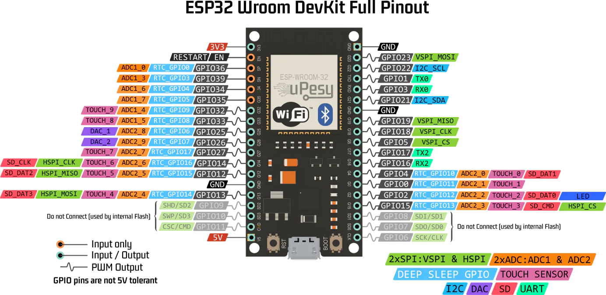

La ESP32 es un sistema con un chip integrado que contiene las siguientes caracteristicas: 
- wifi 
- Bluetooth
- Múltiples periféricos
- Coprocesador de bajo consumo
---
Antes que nada debemos aclarar que una salida analógica se refiere a continuo y digital a discreto.

---
Para empezar conociendo a la ESP32 necesitamos saber que son los pines y que es pinout, un pin es un contacto eléctrico o terminal en un circuito integrado, o dispositivo electrónico. Por su parte pinout es una representación o diagrama que muestra la disposición y función de cada uno de estos pines. El pinout de la ESP32 es:
Aquí hay muchos conceptos, entonces vamos a desglosar uno por uno.
### GPIO (General Purpose Input/Output)
Significa que este pin puede ser usado como entrada o salida digital, solo puede tener dos estados (ON / OF), (1/0), (High/Low)-> (3.3v/0v). 
Por ejemplo tenemos: 

```c++
pinMode(2,OUTPUT);
digitalWrite(2,HIGH); // Se enciende el led conectado al pin 2
```
### ADC (Analog to Digital Converter)
Este pin convierte voltajes análogicos (Como es un potenciómetro o un sensor de temperatura) en numeros que la ESP32 puede leer, poer ejemplos, tenemos un sensor de luz que cambia de voltaje segun la cantidad de luz, al conectarlo a un pin como `IO34` se puede leer con `analogRead()`.
```c++
int valor = analogRead(34);  // Lee el voltaje como número entre 0 y 4095
```
### I2C (Inter-Integrated Circuit)
Es un protocolo para que la ESP32 se comunique con sensores, pantallas, etc., usando dos cables `SDA`(datos) y `SCL`(reloj).
Los pines por defecto son:
- `SDA` -> GPIO21
- `SCL` -> GPIO22
```c++
Wire.begin(21, 22); // SDA, SCL
```
### PWM (Pulse Width Modulation)
Es una manera de simular una salida analógica usando pulsos digitales rápidos, ysirve para variar el brillo de un led o la velocidad de un motor: 
```c++
ledcWrite(channel, 128); // 128 de 255 es 50% de brillo
```
### UART (Universal Asyncrhonous Receiver-Transmitter):
Sirve para comunicarse por texto con la PC o con algún otro dispositivo, este usa dos pines: 
- `TX` -> Transmite
- `RX` -> Recibe
Por ejemplo, al querer leer un sensor GPS o ver mensajes en el monitor.
### DAC (Digital to Analog Convert)
Convierte un valor digital, por ejemplo, de 0 a 255 o 0 a 4095, a una señal de voltaje analógica real. Sirve para generar tonos de audio, crear señales para controlar otros dispositivos, etc.
```c++
dacWrite(25, 128);  // Envía 1.65V aproximadamente a GPIO25
```
### SD (Tarjetas SD: SDIO/SPI)
La ESP32 puede comunicarse con tarjetas microSD para leer/escribir archivos, hay dos modos de comunicacion: 
- **SPI**: Más común, usa pines reconfigurables
- **SDIO**: Más rápido, una pines fijos y más complejos, aquí están (`SD_DAT1`,`SD_CMD`)
### TOUCH SENSOR (Capacitive Touch)
Es un sensor que permite medir el tacto de mi dedo sin un botón físico, mide la capacitancia del ambiente, tenemos a: 
### VSPI (SPI Bus Virtual)
El ESP32 tiene 2 buses SPI: `HSPI` y `VSPI`
SPI es un protocolo para comunicarse con perfiéricos como pantallas, sensores, tarjetas SD, etc. 
- **VSPI** = SPI "por defecto" en la mayoría de librerías.
Los pines por defecto son: 
- **GPIO18 → SCK (reloj)**
- **GPIO19 → MISO (entrada datos)**
- **GPIO23 → MOSI (salida datos)**
- **GPIO5 → CS (chip select)**
pueden definirse: 
```c++
SPI.begin(18, 19, 23, 5);  // SCK, MISO, MOSI, CS
```
### DEEP SLEEP GPIO (Wakeup pins con RTC_GPIOx)
El ESP32 puede "dormirse" para ahorrar energía (modo **deep sleep**).  
Puede **despertar cuando un pin cambia de estado**, pero **solo algunos pines tienen esta capacidad** especial.

```c++
esp_sleep_enable_ext0_wakeup(GPIO_NUM_4, 0);  // Despierta cuando GPIO4 está en LOW
esp_deep_sleep_start();
```