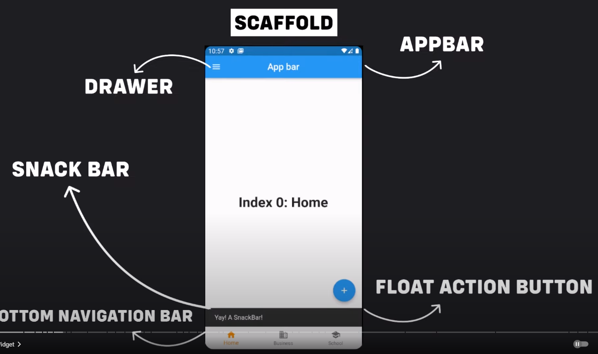

# Flutter: [ Por ahora pausado]

Para crear una aplicación en flutter, necesitamos de primero entender como funciona: 
código de una app sencilla: 

```dart
import 'package:flutter/material.dart'; // Aqui importamos todos los widgets de flutter por ahora

void main() => runApp(app());

class app extends StatelessWidget{
	
	const app({key? key}) : super(key:key);
	
	@override
	Widget build(BuildContext context){
		return MaterialApp(
			title:"miApp",
			home: Inicio(),
		);
	}
}

class Inicio extends StatefulWidget {
	Inicio({Key?key}) : super(Key: key);
	
	@override
	_InicioState createState ()=>_InicioState();
}

class _InicioState extends State<Inicio> {
  @override
  Widget build(BuildContext context) {
      return Scaffold(
          appBar: AppBar(
            title: Text("Mi app"),
          ),
        body: Center(child: Text("contenido"),),
      );
  }
}
```

Anotaciones que vamos a hacer son: 

1. Aqui usamos ()⇒  que es para devolver funciones de manera inmediata 
2. los símbolos ‘{}’ hacen referencia a parámetros nombrados en constructores y funciones
Ejemplo: 

```dart
class Persona {
  String nombre;
  int edad;

  // Constructor de la clase Persona
  Persona({required this.nombre, required this.edad});
}

class Estudiante extends Persona {
  String matricula;

  // Constructor de la clase Estudiante
  Estudiante({required String nombre, required int edad, required this.matricula})
      : super(nombre: nombre, edad: edad);
}
```

---

Lo que básicamente estamos haciendo es creando un `void main() => runApp(app());` donde correrá nuestra app, a continuación creamos la clase `app` que extenderá de `StatelessWidget`  que es como un canva en donde no hay nada. Ahi mismo sobre escribimos un método `build(BuildContext context)` que retorna un tipo Widget (Los widgets son lo mas importante  ya que de eso se basa esta programación, TODO ES UN WIDGET).

La manera en que el método `build(BuildContext context)` retorna es un Widget llamado “Material App”  

### ¿Qué es MaterialApp?:

Es un widget de Flutter que envuelve la aplicación. Al usar `MaterialApp`, obtienes acceso a muchos widgets y elementos de Material Design, como `Scaffold`, `AppBar`, `FloatingActionButton`, y más.

¿Qué propiedades tiene? :

- **title**:
    - Especifica el título de la aplicación, que puede aparecer en algunas plataformas (por ejemplo, como el nombre de la ventana en el escritorio).
- **home**:
    - Define el widget principal o la página de inicio de la aplicación. Es el primer widget que se muestra cuando se inicia la aplicación.
- **theme**:
    - Permite definir un tema global para la aplicación utilizando la clase `ThemeData`. Esto incluye colores, estilos de texto, y otros atributos visuales que se aplican a los widgets de Material Design.
- **initialRoute**:
    - Define la ruta inicial que se carga cuando se inicia la aplicación. Es útil cuando tienes una aplicación con múltiples páginas y deseas iniciar en una página diferente a la definida en `home`.
- **routes**:
    - Es un mapa que define las rutas disponibles en la aplicación y los widgets asociados a cada ruta. Facilita la navegación entre diferentes pantallas.
- **navigatorKey**:
    - Permite controlar la navegación y mostrar diálogos desde cualquier parte del código mediante una referencia al `Navigator`.
- **localizationsDelegates** y **supportedLocales**:
    - Proporcionan soporte para la localización de la aplicación, permitiendo traducir el contenido a diferentes idiomas.
    

### ¿Hay otros ademas de MaterialApp?

En efecto. Existe `CuerpinoApp` y `WidgetsApp`  donde básicamente: 

- **MaterialApp**: Para aplicaciones con Material Design.
- **CupertinoApp**: Para aplicaciones con diseño de iOS.
- **WidgetsApp**: Para aplicaciones que necesitan una estructura básica sin estilos específicos.

---

Como vimos, para MaterialApp usamos home , y dentro de home llamamos a otra clase, en este caso una que extiende de `StatefulWidget`  que como dice el nombre, esta puede cambiar a lo largo del ciclo de vida de la aplicación, no como la extensión `StatelessWidget` Por lo general se compone de: 

```dart
class MyHomePage extends StatefulWidget {
  final String title;

  MyHomePage({required this.title}); 

  @override
  _MyHomePageState createState() => _MyHomePageState();
}

class _MyHomePageState extends State<MyHomePage> {
  int _counter = 0;
//... Resto del codigo
}
```

En el código anterior, el inicial, nosotros usamos “`key? key`” mientras que en este código no fue necesario, entonces que es Key? 

### Key, ¿Qué es? :

`Key` es un parámetro opcional que se pasa al constructor de `Inicio`. Los `Key` se utilizan para identificar de forma única widgets en el árbol de widgets y para preservar su estado cuando la estructura del árbol cambia.
Al llamarla con `super()` lo que hacemos es llamar al constructor de la clase padre (`StatefulWidget`) con el `key` proporcionado. Esto asegura que el `Key` se pase correctamente a la clase base, lo que permite a Flutter utilizarlo para la gestión del estado y la identificación de widgets.

### ¿Cuándo se necesita un Key?

Usar un `Key` es útil en situaciones donde:

- Hay listas o conjuntos de widgets dinámicos.
- Los widgets pueden cambiar de orden.
- Necesitas preservar el estado de un widget cuando cambia su posición en el árbol de widgets.

Saltándonos ya la parte vista, tenemos que sobre escribe una clase PRIVADA es decir, que solo se usa en ese único archivo , esta es una clase que extiende de State<*nombre_del_apartado*> 

### La Clase `State` :

La clase `State` es la que realmente maneja el estado mutable del `StatefulWidget`. Cada `StatefulWidget` tiene una clase `State` asociada que extiende `State<T>`, donde `T` es el tipo del `StatefulWidget` al que está asociado. Esta clase `State` contiene el estado mutable y la lógica para modificar ese estado.

Entonces aqui nosotros ya creamos la clase que es la que maneja el estado mutable: 

```dart
class _InicioState extends State<Inicio> {
  @override
  Widget build(BuildContext context) {
      return Scaffold(
          appBar: AppBar(
            title: Text("Mi app"),
          ),
        body: Center(child: Text("contenido"),),
      );
  }
}
```

Aqui observamos a SCAFFOLD. ¿Qué es?

### Scaffold Flutter:

`Scaffold` es un widget en Flutter que proporciona una estructura de diseño básica para la mayoría de las aplicaciones. Es una clase que ayuda a implementar el diseño básico de Material Design.
 Con `Scaffold`, puedes crear una interfaz de usuario que sigue las directrices de Material Design, proporcionando un diseño coherente y una apariencia familiar a los usuarios.

### Principales Elementos de `Scaffold`

`Scaffold` incluye varios elementos importantes que se utilizan comúnmente en las aplicaciones de Flutter:

1. **`appBar`**: Un `AppBar` es una barra de aplicaciones que generalmente contiene el título de la aplicación, botones de acción, un menú de navegación, etc.
2. **`body`**: El área principal donde se muestra el contenido de la aplicación.
3. **`floatingActionButton`**: Un botón de acción flotante (FAB) que generalmente se utiliza para acciones primarias.
4. **`drawer`**: Un panel de navegación lateral que se puede abrir desde el lado izquierdo.
5. **`bottomNavigationBar`**: Una barra de navegación inferior para moverse entre diferentes secciones de la aplicación.
6. **`bottomSheet`**: Un panel que se desliza desde la parte inferior de la pantalla.
7. **`persistentFooterButtons`**: Una fila de botones que siempre se muestra en la parte inferior de la pantalla.

Otros como Scaffold esta CupertinoPageScaffold que es el mismo Scaffold pero para Cupertino , que es para IOS. 

Scaffold se puede ver como: 



## Scaffold Modificación:

Ya vimos que es Scaffold, ahora miraremos como se modifica, el appBar y que cosas van dentro de Body que es como lo más importante.

### AppBar:

Para configurar el color dentro de la AppBar nosotros usamos el comando `backgroundColor: Colors.*color`*  Ahora veremos con mayor detenimiento que es la clase AppBar.

AppBar consiste en ser una barra de herramientas que puede tener otros widgets como lo son las TabBar o los FlexibleSpaceBar, por lo general tiene IconButtons o un PopupMenuButton.

