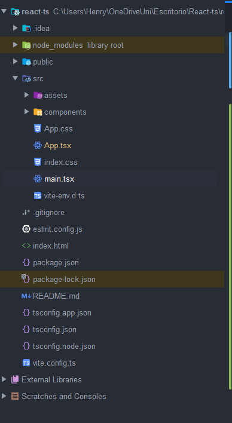

# React

Lo primero que he hecho ha sido: 

1. Instalar Bun que es como un node.js 2.0 : 
    
    `powershell -c "irm bun.sh/install.ps1 | iex"`
    
    `npm install -g bun`
    
2. Inicie una app de react: 
    
    `bun create react-app my-react-app`
    También se puede con (VITE) que es como una herramienta pa crear eso al igual que webPack: 
    `npm create vite@latest <nombre-de-mi-proyecto>` 
    
3. Ahi encontré unos errores e instale:
    
    `npm install react@18 react-dom@18`
    
    1. Volví al paso 2 y todo funcionó. 

Una vez adentro vamos a entender pequeñas cosas como lo que son los componentes, un componente es la mínima parte de lógica que se puede llegar a tener, y básicamente, estas son funciones. 

Primero miraremos rápidamente la estructura del proyecto: 



La primera parte que vemos, es como esta dividido el proyecto en una parte publica (carpeta public), y luego la carpeta src que es donde encontramos lo que necesitamos del proyecto. 
También vemos el `index.html` que es esencial para el proyecto : 

### Index.html :

```html
<!doctype html>
<html lang="en">
  <head>
    <meta charset="UTF-8" />
    <link rel="icon" type="image/svg+xml" href="/vite.svg" />
    <meta name="viewport" content="width=device-width, initial-scale=1.0" />
    <title>Vite + React + TS</title>
  </head>
  <body>
    <div id="root"></div>
    <script type="module" src="/src/main.tsx"></script>
  </body>
</html>

```

 Aquí es sencillo y lo importante es el `id="root"` y abajo el script que se carga que es `main.tsx`  

### main.tsx :

```tsx
import { StrictMode } from 'react'
import { createRoot } from 'react-dom/client'
import './index.css'
import App from './App.tsx'

createRoot(document.getElementById('root')!).render(
  <StrictMode>
    <App />
  </StrictMode>,
)

```

Dentro de `main.tsx` vemos cosas que son interesantes, en primera instancia el ‘tsx’ la cual nos quiere decir que ese archivo devuelve como defecto html y lógica. 

Ahora miraremos los import, cada uno de estos importa, en primer lugar el `StrictMode` la cuál no se coloca en producción debido a que su función es evaluar como están funcionando los componentes y hace re-renders de estos mismos.

Luego esta la importación de `createRoot` la cual es el inicio de todo el programa en sí. Después importa lo que son los css y esto es lo interesante, cuando se hace importaciones de css o de componentes “.tsx” automáticamente se crea la implementación de estos, por lo que, al importar el `./index.css` y también `App from './App.tsx'` estamos implementando ya el primer css y primer componente de la aplicación.

Ahora veremos como esta estructurado `App.tsx`  : 

## App.tsx :

```tsx
import './App.css';
import Button from './components';
import {useState} from "react";

function App(){
const [data,setData] = useState(0);

return(
	<>
		<Button label="Boton" parentMethod="() => {}"/>
	</>

);

}

export default App;
```

En esta función podemos ver varias cositas, y es, en primer lugar, como el componente en si es una función, sin embargo no siempre debe ser eso, tambien puede ser una constante que este definida como función: 

```tsx
const App = () => {
 // .... resto del código
}
```

Tambien vemos al final del código el `export default App` aquí decimos que aunque no se use en este archivo, se usara o puede estar siendo usado en otros archivos, y asi no generar error.

Continuamos con el return en donde retorna lo que es otro componente en este caso es el componente `Button` el cual le estamos pasando algunos parámetros que ya veremos mas adelante.

Aqui también encontramos algo importante que son los `Hooks`,uno de estos es `useState` la cual nos genera un estado que nos indica cuando la aplicación cambia, es como si este `hook` implementara lo getters y setters al parámetro que se le está dando, en este caso es ‘data’ , y su set es ‘setData’ . Tambien se le pone su valor inicial, aquí sería 0. [recordar que nos indica el render del componente para cuando cambie el data]. 

## Button.tsx :

```tsx
import "./Button.css"

interface Props {
    label: string
    parentMethod: () => void
}

export const Button = ({label,parentMethod}:Props)=> {

    return(
        <>
        <button className="custom-button" onClick={parentMethod} >
            {label}
        </button>
        </>
    )
}
```

Aquí tenemos algo importante y son dos cosas; en primer lugar tenemos la `interface` Props en la que cuenta con dos “propiedades” o características: `lable` `parentMethod` el primero es un `string` mas el segundo es un `metodo` .

Dentro del la constante `Button` que sigue siendo una constante que es igual a una función como argumento pasamos la destructuración de la interfaz, es decir, pasamos los tipos que deben ser de la clase o en este caso Interfaz y le indicamos que estas son del tipo `Props`.  Y como vimos anteriormente al llamado del componente le pasamos estas propiedades directamente y de esta manera creamos un componente que puede ser llamado en otras partes.

## UseEffect :

UseEffect al igual que UseState son los llamados Hook, en este caso su funcionalidad se basa en comunicarnos o obtener todos los datos externos a nuestra aplicación o componente, por ejemplo: 

- Comunicarnos con un endpoint
- Sincronizar con entidades externas
- Operaciones asíncronas como timeout o un listener, etc.
- Parámetros de entrada

PE: 

```tsx
import './App.css'
import {useEffect, useState} from "react";
import {Button} from "./components";

function App() {
    const [data, setData] = useState([]);
    const [loading, setLoading] = useState(true);
    const [error, setError] = useState("");

    const fetchData = async () => {
        setLoading(true);
        try {
            const response = await fetch("http://localhost:8080/api/brand/");
            if(!response.ok){
                throw new Error("error al obtener datos");
            }
            const jsonData = await response.json();
            setData(jsonData);
        } catch (error) {
            setError(error as string);
        } finally {
            setLoading(false);
        }
    }
    
    useEffect(() => {
        fetchData();
    }, []); // acepta un method y un arreglo de dependencias

    if (loading) {
        return (
            <div> Esta cargando </div>
        )
    }
    if (error) {
        return (
            <div>{error}</div>
        )
    }
    return (
        <>
            data:
            <div> {JSON.stringify(data)}</div>
            <Button label="hola" parentMethod={()=>{}}/>
        </>
    )
}

export default App

```

El código anterior tenemos un método que se llama `fetchData()` el cual es una función asíncrona que espera los datos de un endpoint , esta al ser asíncrona debe ser llamada por el Hook  que controla estas cosas. Este Hook tiene como argumentos dos instancias, la primera es el callback del efecto y el segundo  es la lista de las dependencias, eso quiere decir que se ejecuta cuando alguna de estas dependencias cambian, por ejemplo: 

 

```tsx
// Sin dependencias:  Ejecuta en cada renderizado
useEffect(() => {
  console.log('Se ejecuta en cada renderizado');
});

// Con un array vacio: solo se ejecuta una vez que el componente se monta:
useEffect(() => {
	  console.log('Se ejecuta una vez al montar el componente');
},[]);

//Con dependencias especificas:Se ejecuta cuando alguna de estas cambia. 
useEffect(() => {
  console.log('El valor de "count" cambió');
}, [count]);

```

**Básicamente `useEffect` es un Hook de React que te permite [sincronizar un componente con un sistema externo.](https://es.react.dev/learn/synchronizing-with-effects)**

## UseCallBack:

**`useCallback` es un Hook de React que te permite almacenar la definición de una función entre renderizados subsecuentes.**

Ejemplo: 

```tsx
import './App.css'
import {useCallback, useEffect, useState} from "react";
import {Button} from "./components";

function App() {
    const [data, setData] = useState([]);
    const [loading, setLoading] = useState(true);
    const [error, setError] = useState("");

    const consoleLoader = useCallback(
        (loadingValue: boolean) => {
        setLoading(loadingValue);
        console.info(loading);
    }, [loading])

    const fetchData = useCallback(
        async () => {
            consoleLoader(true);
            try {
                const response = await fetch("http://localhost:8080/api/brand/");
                if (!response.ok) {
                    throw new Error("error al obtener datos");
                }
                const jsonData = await response.json();
                setData(jsonData);
            } catch (error) {
                if(error instanceof Error) {
                    setError(error.message);
                }
                else{
                    setError(String(error));
                }
            } finally {
                consoleLoader(false);
            }
        }
        , [consoleLoader]
    )
    useEffect(() => {
        fetchData();
    }, [fetchData]);

    if (loading) {
        return (
            <div> Esta cargando </div>
        )
    }
    if (error) {
        return (
            <div>{error}</div>
        )
    }

    return (
        <>
            data:
            <div> {JSON.stringify(data)}</div>
            <Button label="hola" parentMethod={() => {
            }}/>
        </>
    )

}

export default App

```

Ahi lo que hacemos nosotros es usar el useCallback para hacer el código mas legible debido a que no es tan atractivo tenerlo todo en useEffect, ademas, este es el paso a paso o el flujo del programa: 

1. **Inicializa el componente:** 
    1. React llama al componente `App` por primera vez.
    2. En ese momento se inicializan los estados: 
        
        ```tsx
        const [data, setData] = useState([]);
        const [loading, setLoading] = useState(true);
        const [error, setError] = useState("");
        ```
        
2. **`useEffect` se ejecuta después del render inicial.**
    1. Una vez que el componente se renderiza por primera vez, React ejecuta el efecto definido con `useEffect`:
        
        ```tsx
        useEffect(() => {
          fetchData();
        }, [fetchData]);
        ```
        
3. **La función `fetchData` se ejecuta**: 
    1. Durante la ejecución de `fetchData`, primero se llama a `consoleLoader(true)` para indicar que está cargando.
    2. Se realiza la petición fetch al endpoint y se procesa la respuesta.
    3. Finalmente, se actualiza el estado con los datos obtenidos o se maneja el error si ocurre, y se marca como completado con `consoleLoader(false)`.

Y cuando react identifique un cambio en alguno de los estados vuelve a renderizar el componente.

## Custom Hooks :

Hay diferentes Hooks como ya los vimos anteriormente, pero nosotros necesitamos mucho hacer uno nuestro para poder facilitar la vida: 

Recordar que todos los hooks empiezan con **use** entonces, lo siguiente es un custom hook, aunque primero pasaremos el directorio: 


```tsx
import {useEffect, useState} from "react";

type Data<T> = T | null;
type ErrorType = Error | null;

interface Params<T> {
    data: Data<T>;
    loading: boolean;
    error: Error | null;
}

export function useFetch<T>(url: string): Params<T> {
    const [data, setData] = useState<Data<T>>(null);
    const [loading, setLoading] = useState<boolean>(true);
    const [error, setError] = useState<ErrorType>(null);

    useEffect(() => {
        let controller = new AbortController();

        setLoading(true);
        const fetchData = async () => {
            try {
                const response = await fetch(url, controller);
                if (!response.ok) {
                    throw Error(response.statusText);
                }
                const jsonData: T = await response.json();
                setData(jsonData);
                setError(null);
            } catch (error) {
                setError(error as Error);
            } finally {
                setLoading(false);
            }
        }
        fetchData();

        return () => {
            controller.abort();
        }

    }, [url]);

    return {data, loading, error}
}

```

Aquí nosotros observamos diferentes cosas que vamos a desglosar: 

Como primera instancia creamos los `type` que nosotros vamos a usar, en este caso es como “crear” una variable, luego pasamos una `interface` la cual hará en : ¿Qué nosotros necesitamos de este hook? , nosotros necesitamos, al ser un fetch , una `data`,`loading`,`error`de esta forma nosotros manejaremos cuando se efectúe o no la conexión a la dichosa api. 

Luego usaremos la función que ahora si, es nuestro hook: `useFetch` aqui hay cosas interesantes que ver; primero el uso de genéricos o `generics` para de esta forma hacer que admita cualquier tipo de dato que luego veremos lo interesante; segundo pasa una url como parámetro y luego con las `:Params` indicamos que es lo que devolverá, es decir un objeto de la interface creada; en tercer lugar usamos los `useState` y el `useEffect` y aqui no usamos el `useCallback` ya que no se ve necesario; en cuarto lugar realizamos algo similar a lo que ya habíamos realizado antes con la pequeña diferencia de usar un `controller` que se usa para abortar si algo llegase a pasar para que de esta manera no consuma memoria sin sentido.

Este es en general el cómo se crea un hook . [*ademas cabe recalcar que usamos un `index.ts` para almacenar todos los hooks que usaremos a lo largo del proyecto*] .

La manera en como se monta ese hook es de la forma que siempre se hace, en este caso 

```tsx
...
const {data,loading,error} = useFetch<*generic*>(url);
...
```

## Composition Pattern:

Primero miraremos cuales son las formas de pasar datos de un componente padre a un componente hijo .

La manera mas común es usar props, la cual, ya hemos visto en la que se coloca a la hora de llamar al componente , las propiedades para iniciar dicho componente. Dentro de esas props podemos añadirle tambien “hijos”, o componentes para pasarles y que a esos componentes les haga algo, o simplemente anexarlos, sucede de la siguiente forma: 

```tsx
import {ReactNode} from "react"
import "./Button.css"

interface Porps{
	children: ReactNode,
	parentMethod: ()=>void 	
}

interface ChildrenProps{
	children: ReactNode,
}

export const ColorRed = ({ children }: ChildrenProps) => {
	return ( <div className="color-red"> {children} </div> )
}

export const Button = ({children,parentMethod}:Props) => {
	return (
		<button className="custom-button" onClick={parentMethod}>
		{children}
		</button>
	)
}
```

Y miremos este código: 

```tsx
import './App.css'
import {Button,ColorRed} from './components'

function App() {

	const handleClick = () => {
		console.log("hace algo");
	}
	
	const dimeHola = () => {
		alert("hola !! ")
	}
	
	return (
		<>
			<ColorRed> <Button parentMethod={dimeHola}>Mi Boton Rojo</Button></ColorRed>
			<Button parentMethod={handleClick}> Mi Boton Normal </Button>
		</>
	)
}
```

Aquí podemos observar como funciona esto de el patrón composite, también podemos usar este patrón para la creación de formularios, etc.

Por ejemplo por afuera se vería algo de este estilo: 

```tsx
...

const submit = () => {
	...
}

return  ( 
...
<AppForm>
	<button type="submit" onClick={submit}></button>
 </AppForm>
 ...
 )
...
```

Y en AppForm: 

```tsx
interface Props {
	children: ReactNode,
}

export AppForm = () => {

	return (
		<form>
			{/*Los inputs*/}
			{children}
		</form>
	)

}
```

Dentro de este AppForm vendría una lógica mas personalizada.

## Formularios con Zod:

React Hook form es lo primero que usaremos para crear los formularios: 

```makefile
npm install react-hook-form zod @hookform/resolvers
```

React-hook-form es  la libreria con la que hacemos los formularios y Zod las validaciones.

Primero debemos pensar como deben ser las propiedades del formulario, es decir, el esquema

```tsx
import {zodResolver} from "@hookform/resolvers/zod"
import {useForm} from "react-hook-form"
import {z} from "zod"

const schema = z.object({
		name: z.string().min(1,"El nombre es obligatoio"), // aqui estan las validaciones y mensaje de error.
		email: z.string().email("Correo invalido").min(1,"El Correo es obligatorio"),
		password: z.string().min(6, "La contraseña debe de tener al menos 6 caracteres")
		confirmPassword: z.string().min(6,"La confirmación debe tener al menos 6 caracteres")
}).refine(data => data.password === data.confirmPassword, {
message: "Las contraseñas son invalidas",
path: ['confirmPassword']
}) 

//vamos a inferir el tipo del esquema: 
type FormValues = z.infer<typeof schema>;

// ahora viene el componente: 

const CustomForm = () => {
//este es un custom state: 
	const [state,setState] = useState();
	const {control,handleSubmit, formState: {error}} =useForm<FormValues>({
		resolver:zodResolver(schema)
	})
	
	const onsubmit: SubmitHandler<FormValues> = (data) => {
		console.log(data)
	}

return (

	<form onSubmit={handleSubmit(onSumbit)}> 
		<InputForm name="name" control={control} label="name" type="text" error={error.name}/> {/* Se puede reutilizar*/}
		<button type="submit">Submit</button>
	</form>
)

}

export default CustomForm;
```

Ahora hacemos el customImput porque el formulario no debe tener logica que no le toca: 

```tsx
interface Props{
	name:string;   // Podemos poner en ves de string: keyof FormValues
	control:Control<any>; // Control<FormValues>
	label:string;
	type?:string;
	error?:FieldError;
}

const InputForm = ({name,control,label,type,error}:Props) => {

	return(
		<div className="form-group">
				<label htmlFor={name}>{label}</label>
				{/*El controller*/}
				<Controller name={name} 
				control={control} 
				render={({field}) => 
					<input id={name} type={type} {...field} className={`form-control ${error? "is-invalid": ""}`}/>
					}
					/>
					{error && <p className="error">{error.message}</p>}
			</div> 
	)

}

export default InputForm;
```

# UseRef y useCallback

Cuales son los objetivos de `useRef` y `useCallback` . Uno de los objetivos son:

- Nos permite crear una referencia mutable que persiste durante todo el ciclo de vida del componente sin causar un re-render. [ un useState sin renderizar el componente]
- Hacer referencia a un elemento del DOM

Un ejemplo sencillo: 

```jsx
export const BookReader = () =>{
	const currentPageRef = useRef<number>(1);

	const nextPage = () => {
	 currentPageRef.current +=1;
	 console.log(`Avanzaste a la pagina ${currentPageRef.current}`)
	}
	// Metodo
	const previousPage = () => {
	if(currentPageRef.current === 1){
		console.log('No se puede retroceder mas')
		return;
	}
	 currentPageRef.current -=1;
	 console.log(`Retrocediste a la pagina ${currentPageRef.current}`)
	}
	
	// Metodo
	const goToPage= (page:number) => {
		if(page<1){
			console.log("No se puede saltar a un valor imposible")
			return;
		}
		
		currentPageRef.current = page;
	}
	
	
	return(
		<div>
			<h2>Lectura de Libro </h2>
			<p> Página actual: {currentPageRef.current}</p>
			<button onClick = {previousPage}>Pagina anterior</button>
			<button onClick = {nextPage}>Pagina siguiente</button>
			<button onClick = {()=>goToPage(50)}>ir a la pagina 50</button>
		</div>
	)

}
```

La diferencia entre useState y useRef es que el Ref NO crea un rerender. mientras que useState mediante el `set` crea el re-render

Otro de la utilidad del useRef es para elegir un elemento del dom: 

```jsx
export const FocusInput=()=>{
	const inputRef = useRef<HTMLInputElement>(null);
	
	const handleButtonClick = () => {
		if(!inputRef.current)
		{
			console.log("No hay referencia al elemento")
			return;
		}
		inputRef.current.focus()
	
	}
	
	return (
		<div>
		   <input ref{inputRef} type="text" placeholder = "Escribe algo aqui . . ."> </input>
		   <button onClick={handleButtonClick}> enfocar en el input></button>
		</div>
	)

}
```

## UseMemo: